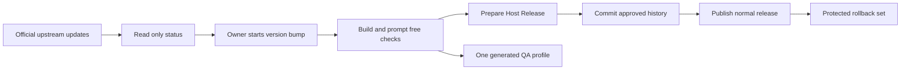

# DBCode Wrapper codebase wiki

DBCode Wrapper is a focused macOS host for the official, unmodified DBCode extension. The wrapper owns the desktop identity, focused shell, isolated profile, build, update status, and release safety. DBCode still owns database connections, editors, grids, notebooks, AI, MCP, accounts, and licences.

DBCode's own query results open below the query at every window width. The wrapper sets that one result-location preference and leaves the result grid, Inspector, copy, and export behavior with DBCode.

This wiki is a learning map, not a second source of truth. It is anchored to source commit [`ca6a58c`](https://github.com/alexwck/dbcode-wrapper/tree/ca6a58c0be798dfb6438f8326417ebd9ba42a354). Check current source and tests when details disagree.

Use the [latest release page](https://github.com/alexwck/dbcode-wrapper/releases/latest) for the current published Host Release. Releases are normal published releases in this repository. Public assets contain only the verified wrapper-host DMG and checksum; DBCode is not included.

Automatic read-only polling keeps Code OSS, VSCodium, and DBCode update status visible. It never changes a pin, installs software, approves a candidate, creates a tag, or publishes a release. The repository owner starts those actions after reviewing an update.

The maintained release path has one owner-facing command. `plan` shows the derived tag and paths, `prepare` runs or reuses exact prompt-free evidence and records one approval-history change, and `publish --publish` performs the explicit public release after that history change is committed.

Normal development uses the fast prompt-free source gate. Built-host and rendered checks run only when their boundary changes or a release needs them. Rendered automation reuses one generated `qa` profile and does not start databases, kernels, models, sign-in, licences, or macOS permission flows.

Generated cleanup follows artifact purpose and explicit expiry. It is a dry run by default. Only one exact validated expired path can be applied; caches, worktrees, QA evidence, release assets, rollback data, private profiles, unknown paths, and broad roots stay protected.

> [!NOTE]
> The wiki excludes licence material, credentials, private profiles, generated apps, raw local evidence, proprietary DBCode implementation, and private data. Representative checks do not limit DBCode's connection catalogue.

## Architecture at a glance

The release unit is an [Approved Release Set](concepts/approved-release-set.md): one exact source, build, signed app, external package inventory, profile schema, acceptance report, mounted package receipt, and approval record.

## Suggested learning path

1. Start with [Product and upstream boundaries](architecture/product-and-upstream-boundaries.md).
2. Learn the [Focused host and private profile](architecture/focused-host-and-private-profile.md).
3. Understand [DBCode capability evidence](concepts/dbcode-capability-evidence.md) and [AI and MCP data boundaries](concepts/ai-and-mcp-data-boundaries.md).
4. Follow [First run, activation, and query](flows/first-run-activate-and-query.md).
5. Study [Release trust and compatibility](architecture/release-trust-and-compatibility.md).
6. Use [Choose a verification level](guides/choose-a-verification-level.md) before changing a boundary.
7. Use [Review an upstream update](guides/review-an-upstream-update.md) when a pinned component changes.

## Architecture

- [Product and upstream boundaries](architecture/product-and-upstream-boundaries.md) — what the wrapper owns and what stays with DBCode and the host projects.
- [Focused host and private profile](architecture/focused-host-and-private-profile.md) — how the app bundle and isolated state combine.
- [Release trust and compatibility](architecture/release-trust-and-compatibility.md) — how source, artifacts, evidence, approval, publication, and rollback stay aligned.

## Modules

- [Release Specification](modules/release-specification.md) — validated release identity and purpose-specific records.
- [Release Source Snapshot](modules/release-source-snapshot.md) — one clean immutable source record per build.
- [Compiled Host Cache](modules/compiled-host-cache.md) — safe reuse of unchanged Code OSS compilation.
- [Approved Release Set](modules/approved-release-set.md) — exact matching, approval validation, and tracked history.
- [Profile Layout and Setup](modules/profile-layout-and-setup.md) — generated profile identity and safe setup and recovery.
- [Host Session](modules/host-session.md) — policy-driven launch, observation, result, and shutdown.
- [Patch Plan and build](modules/patch-plan-and-build.md) — ordered upstream patches, compilation, and assembly.
- [Focused Runtime Setup](modules/focused-runtime-setup.md) — shared package verification with thin acquisition adapters.
- [Focused shell and wrapper extensions](modules/focused-shell-extensions.md) — database-first navigation and narrow integrations.
- [Host Release](modules/host-release.md) — the owner-facing prepare and publish task.
- [Generated Workspace Retention](modules/generated-workspace-retention.md) — protected output ownership and exact-path cleanup.
- [Verification Harness](modules/verification-harness.md) — fast source checks and risk-based built checks.

## Flows

- [Build, sign, and launch](flows/build-sign-and-launch.md) — from immutable source to an observed signed session.
- [First run, activation, and query](flows/first-run-activate-and-query.md) — from an empty profile to persisted real results.
- [Approval and guarded rollback](flows/approval-and-guarded-rollback.md) — approve without installing and keep a known-good rollback set.
- [Package and publish a Host Release](flows/package-and-publish-host-release.md) — prepare, record, and explicitly publish the verified host.

## Concepts

- [Approved Release Set](concepts/approved-release-set.md) — the compatibility, publication, and rollback unit.
- [Standalone DBCode Profile](concepts/standalone-dbcode-profile.md) — the external state boundary.
- [Unmodified Extension Boundary](concepts/unmodified-extension-boundary.md) — why integration stays around DBCode.
- [DBCode capability evidence](concepts/dbcode-capability-evidence.md) — declared, reachable, rendered, and live proof.
- [AI and MCP data boundaries](concepts/ai-and-mcp-data-boundaries.md) — provider, payload, client, and test boundaries.
- [Prompt-free acceptance boundary](concepts/representative-acceptance-fixtures.md) — useful evidence without human or service gates.

## Guides

- [Trace a DBCode feature](guides/trace-a-dbcode-feature.md) — find whether behaviour belongs to DBCode, the host, or wrapper code.
- [Choose a verification level](guides/choose-a-verification-level.md) — match evidence cost to change risk.
- [Review an upstream update](guides/review-an-upstream-update.md) — turn public update notices into one reviewed release candidate.

## Keeping this wiki useful

- Check `source_commit` before relying on implementation detail.
- Treat source, policies, and tests as authoritative.
- Refresh affected pages after meaningful architecture, feature-policy, profile, release, shell, or verification changes.
- Keep navigation complete, keep the graph free of dead links, and record each refresh in the [Wiki Log](log.md).