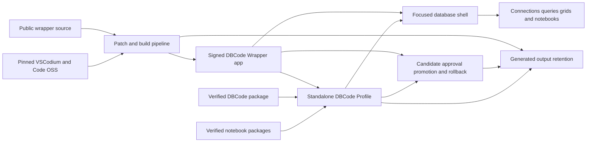

# DBCode Wrapper codebase wiki

DBCode Wrapper is a focused macOS database application built from a slim Code OSS host and the official unmodified DBCode extension. The wrapper owns the desktop identity, focused database shell, isolated profile, compatibility contracts, build patches, verification, and owner-only release process. DBCode continues to own database connectivity and its feature surfaces.

This public wiki is a generated learning map, not a second source of product truth. It is anchored to source commit [`fbf2982`](https://github.com/alexwck/dbcode-wrapper/tree/fbf29827376fd0ea5867082b78e38862878f42b6). When the repository moves beyond that commit, use the source links as historical anchors and refresh the wiki before relying on fine details.

> [!NOTE]
> The public wiki excludes licence material, credentials, private profiles, generated app bundles, raw local evidence, and proprietary DBCode implementation. PostgreSQL, SQLite, DuckDB, Parquet, and notebooks are representative acceptance paths; they do not limit the database connections supported by the approved DBCode extension.

## Architecture at a glance

The main idea is a deliberate split: the app bundle is a slim, replaceable host; the private profile is the durable owner-controlled state. A release is trusted only when the host, profile schema, external packages, signing identity, and evidence agree as one [Approved Release Set](concepts/approved-release-set.md).

## Suggested learning path

1. Start with [Product and upstream boundaries](architecture/product-and-upstream-boundaries.md).
2. Learn why state lives in the [Focused host and private profile](architecture/focused-host-and-private-profile.md).
3. Follow [First run, activation, and query](flows/first-run-activate-and-query.md).
4. Study [Release trust and compatibility](architecture/release-trust-and-compatibility.md).
5. Use [Trace a DBCode feature](guides/trace-a-dbcode-feature.md) when investigating the UI or an upstream contribution.
6. Use [Choose a verification level](guides/choose-a-verification-level.md) before changing a boundary.
7. Read [Generated Workspace Retention](modules/generated-workspace-retention.md) before inspecting or cleaning build and test output.
8. Use [Review an upstream update](guides/review-an-upstream-update.md) when any pinned component changes.

## Architecture

- [Product and upstream boundaries](architecture/product-and-upstream-boundaries.md) — what the wrapper owns and what stays upstream.
- [Focused host and private profile](architecture/focused-host-and-private-profile.md) — how the app bundle and isolated state combine.
- [Release trust and compatibility](architecture/release-trust-and-compatibility.md) — why versions, evidence, promotion, and rollback form one system.

## Modules

- [Release Specification](modules/release-specification.md) — canonical validation and projections from the release lock.
- [Approved Release Set](modules/approved-release-set.md) — prepared, approved, installed, and history record logic.
- [Profile Layout and Setup](modules/profile-layout-and-setup.md) — safe profile paths, first run, migration, and recovery.
- [Host Session](modules/host-session.md) — policy-driven launch, observation, result, and shutdown.
- [Patch Plan and build](modules/patch-plan-and-build.md) — ordered upstream patches and host construction.
- [Focused Runtime Setup](modules/focused-runtime-setup.md) — verified DBCode and notebook package installation.
- [Focused shell and wrapper extensions](modules/focused-shell-extensions.md) — database-first navigation and narrow integrations.
- [Private Personal Release](modules/private-personal-release.md) — owner-only packaging and transfer safeguards.
- [Generated Workspace Retention](modules/generated-workspace-retention.md) — classified ownership, protected inventory, and explicit dry-run cleanup planning.
- [Verification Harness](modules/verification-harness.md) — layered source, rendered, profile, database, and release checks.

## Flows

- [Build, sign, and launch](flows/build-sign-and-launch.md) — from pinned inputs to an observed signed session.
- [First run, activation, and query](flows/first-run-activate-and-query.md) — from an empty profile to persisted real results.
- [Controlled upgrade and rollback](flows/controlled-upgrade-and-rollback.md) — prepare, verify, approve, promote, health-check, and restore.
- [Package and transfer a private release](flows/package-and-transfer-private-release.md) — safely move an owner-only build to another personal Mac.

## Concepts

- [Approved Release Set](concepts/approved-release-set.md) — the actual compatibility and rollback unit.
- [Standalone DBCode Profile](concepts/standalone-dbcode-profile.md) — the owned external state boundary.
- [Unmodified Extension Boundary](concepts/unmodified-extension-boundary.md) — why integration stays around the official DBCode package.
- [Representative acceptance fixtures](concepts/representative-acceptance-fixtures.md) — how a small real matrix proves varied boundaries without narrowing support.

## Guides

- [Trace a DBCode feature](guides/trace-a-dbcode-feature.md) — find whether behavior belongs to DBCode, the host, or wrapper code.
- [Choose a verification level](guides/choose-a-verification-level.md) — match evidence cost to change risk.
- [Review an upstream update](guides/review-an-upstream-update.md) — evaluate independent releases as one candidate set.

## Keeping this wiki useful

- Check the `source_commit` above before relying on implementation detail.
- Follow immutable GitHub source links from each page when reading code.
- Treat repository contracts and tests as authoritative when prose and source disagree.
- Refresh affected pages after meaningful architecture, profile, release, shell, or verification changes.
- Keep the graph free of dead links and record each generation or refresh in the [Wiki Log](log.md).
