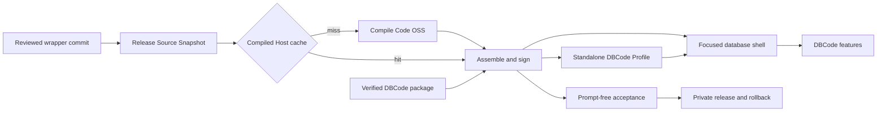

# DBCode Wrapper codebase wiki

DBCode Wrapper is a focused macOS database application built from a slim Code OSS host and the official unmodified DBCode extension. The wrapper owns the desktop identity, focused shell, isolated profile, build and release contracts, and verification. DBCode continues to own database connections, editors, grids, notebooks, AI, MCP, accounts, and licences.

This public wiki is a generated learning map, not a second source of product truth. It is anchored to source commit [`8a70d5c`](https://github.com/alexwck/dbcode-wrapper/tree/8a70d5c18c6b782860a78cd4945bcb04fdb6082b). Check source and tests when details disagree.

> [!NOTE]
> The wiki excludes licence material, credentials, private profiles, generated apps, raw local evidence, and proprietary DBCode implementation. Representative database and notebook checks do not limit the unchanged DBCode connection catalogue.

## Architecture at a glance

The app bundle is a replaceable host and the private profile is durable owner-controlled state. A release is trusted only when its immutable source, compiled host, signed app, external packages, profile schema, and acceptance evidence identify the same [Approved Release Set](concepts/approved-release-set.md).

## Suggested learning path

1. Start with [Product and upstream boundaries](architecture/product-and-upstream-boundaries.md).
2. Learn the [Focused host and private profile](architecture/focused-host-and-private-profile.md).
3. Understand [DBCode capability evidence](concepts/dbcode-capability-evidence.md) and [AI and MCP data boundaries](concepts/ai-and-mcp-data-boundaries.md).
4. Follow [First run, activation, and query](flows/first-run-activate-and-query.md).
5. Study [Release trust and compatibility](architecture/release-trust-and-compatibility.md).
6. Use [Choose a verification level](guides/choose-a-verification-level.md) before changing a boundary.
7. Use [Review an upstream update](guides/review-an-upstream-update.md) when a pinned component changes.

## Architecture

- [Product and upstream boundaries](architecture/product-and-upstream-boundaries.md) — what the wrapper owns and what stays upstream.
- [Focused host and private profile](architecture/focused-host-and-private-profile.md) — how the app bundle and isolated state combine.
- [Release trust and compatibility](architecture/release-trust-and-compatibility.md) — how source, artifacts, evidence, promotion, and rollback stay aligned.

## Modules

- [Release Specification](modules/release-specification.md) — canonical release-lock validation and projections.
- [Release Source Snapshot](modules/release-source-snapshot.md) — one clean immutable source record per build.
- [Compiled Host Cache](modules/compiled-host-cache.md) — safe reuse of unchanged Code OSS compilation.
- [Approved Release Set](modules/approved-release-set.md) — candidate, approval, installed, and history records.
- [Profile Layout and Setup](modules/profile-layout-and-setup.md) — safe profile paths, setup, migration, and recovery.
- [Host Session](modules/host-session.md) — policy-driven launch, observation, result, and shutdown.
- [Patch Plan and build](modules/patch-plan-and-build.md) — ordered upstream patches, compilation, and assembly.
- [Focused Runtime Setup](modules/focused-runtime-setup.md) — verified DBCode and notebook package installation.
- [Focused shell and wrapper extensions](modules/focused-shell-extensions.md) — database-first navigation and narrow integrations.
- [Private Personal Release](modules/private-personal-release.md) — owner-only packaging and transfer safeguards.
- [Generated Workspace Retention](modules/generated-workspace-retention.md) — protected output ownership and dry-run cleanup planning.
- [Verification Harness](modules/verification-harness.md) — fast source, static host, one-profile rendered, and release checks.

## Flows

- [Build, sign, and launch](flows/build-sign-and-launch.md) — from immutable source to an observed signed session.
- [First run, activation, and query](flows/first-run-activate-and-query.md) — from an empty profile to persisted real results.
- [Controlled upgrade and rollback](flows/controlled-upgrade-and-rollback.md) — prepare, verify, approve, promote, health-check, and restore.
- [Package and transfer a private release](flows/package-and-transfer-private-release.md) — safely move an owner-only build to another personal Mac.

## Concepts

- [Approved Release Set](concepts/approved-release-set.md) — the compatibility and rollback unit.
- [Standalone DBCode Profile](concepts/standalone-dbcode-profile.md) — the owned external state boundary.
- [Unmodified Extension Boundary](concepts/unmodified-extension-boundary.md) — why integration stays around the official DBCode package.
- [DBCode capability evidence](concepts/dbcode-capability-evidence.md) — declared, reachable, rendered, and live proof.
- [AI and MCP data boundaries](concepts/ai-and-mcp-data-boundaries.md) — provider, payload, client, and test boundaries.
- [Representative acceptance fixtures](concepts/representative-acceptance-fixtures.md) — small useful checks without narrowing support.

## Guides

- [Trace a DBCode feature](guides/trace-a-dbcode-feature.md) — find whether behaviour belongs to DBCode, the host, or wrapper code.
- [Choose a verification level](guides/choose-a-verification-level.md) — match evidence cost to change risk.
- [Review an upstream update](guides/review-an-upstream-update.md) — evaluate independent releases as one candidate set.

## Keeping this wiki useful

- Check `source_commit` before relying on implementation detail.
- Treat repository contracts and tests as authoritative.
- Refresh affected pages after meaningful architecture, feature-policy, profile, release, shell, or verification changes.
- Keep the graph free of dead links and record each refresh in the [Wiki Log](log.md).