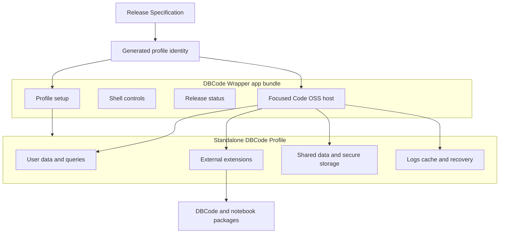

## Summary

The application has two cooperating halves. The app bundle provides a slim Code OSS runtime and small wrapper extensions. A separate Standalone DBCode Profile holds settings, installed DBCode and notebook packages, secure-storage identity, caches, logs, queries, and recovery state.

One generated profile identity joins these halves. It comes from [Release Specification](../modules/release-specification.md) and gives shell and JavaScript callers the same application, bundle, folder, query-storage, and profile-schema values.

The production profile survives compatible app replacement. Automated rendered checks use one separate persistent generated `qa` profile with Chromium's mock Keychain. They do not reset the profile or exercise first-use, licence, kernel, model, OAuth, or macOS permission prompts during deployment.

## Diagram

## Key components

- [Release Specification](../modules/release-specification.md) owns the profile and product identity.
- [Profile Layout and Setup](../modules/profile-layout-and-setup.md) loads the generated identity, validates every owned path, and keeps setup and recovery behind one tested workflow.
- [Host Session](../modules/host-session.md) launches the bundle with exact profile arguments and observes its lifecycle.
- [Focused Runtime Setup](../modules/focused-runtime-setup.md) verifies pinned packages before installing them externally.
- [Focused shell and wrapper extensions](../modules/focused-shell-extensions.md) render the database-oriented shell and generated query path.
- [Verification Harness](../modules/verification-harness.md) owns static identity checks and the persistent prompt-free QA profile.

Identity loading starts in [`profile-layout.js`](https://github.com/alexwck/dbcode-wrapper/blob/ddaa6a0b7b906af9994221e98ca8f0a0ef3c93b1/host/extensions/dbcode-wrapper-profile-migration/profile-layout.js). Generation lives in [`generate_profile_identity.sh`](https://github.com/alexwck/dbcode-wrapper/blob/ddaa6a0b7b906af9994221e98ca8f0a0ef3c93b1/script/generate_profile_identity.sh). Profile Setup ordering lives in [`profileSetup.js`](https://github.com/alexwck/dbcode-wrapper/blob/ddaa6a0b7b906af9994221e98ca8f0a0ef3c93b1/host/extensions/dbcode-wrapper-profile-migration/profileSetup.js).

## Design decisions

- Product and profile names have one source in the Release Specification.
- The normal personal profile and generated QA profile have separate owned roots.
- Missing, stale, linked, malformed, or mismatched identity fails closed.
- Mutating operations must prove every target is inside its expected owner root.
- The app bundle does not contain the licensed DBCode package or user profile.
- Normal VS Code profiles are outside wrapper ownership.
- Keychain and macOS prompts remain user choices. Automation uses a mock Keychain and never approves a real prompt.
- Recovery is explicit and conservative. It is not part of the default deployment path.

## Related

- [Standalone DBCode Profile](../concepts/standalone-dbcode-profile.md)
- [First run, activation, and query](../flows/first-run-activate-and-query.md)
- [Build, sign, and launch](../flows/build-sign-and-launch.md)
- [Choose a verification level](../guides/choose-a-verification-level.md)
- [AI and MCP data boundaries](../concepts/ai-and-mcp-data-boundaries.md)