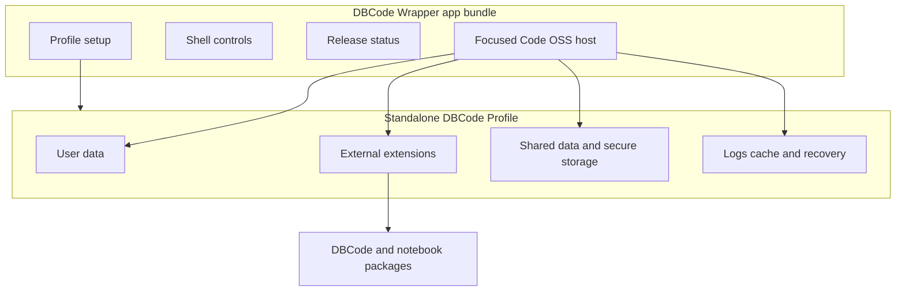

## Summary

The application has two cooperating halves. The app bundle provides a slim Code OSS runtime and small wrapper extensions. A separate Standalone DBCode Profile holds settings, secure-storage identity, installed DBCode and notebook packages, caches, logs, and recovery state.

The production profile survives compatible app replacement. Automated rendered checks use one separate persistent generated `qa` profile with Chromium's mock Keychain. They do not reset the profile or exercise first-use, licence, kernel, model, OAuth, or macOS permission prompts during deployment.

## Diagram

## Key components

- [Host Session](../modules/host-session.md) launches the bundle with exact profile arguments and observes its lifecycle.
- [Profile Layout and Setup](../modules/profile-layout-and-setup.md) validates every owned path and keeps setup, migration, cleanup, and recovery order behind one tested workflow.
- [Focused Runtime Setup](../modules/focused-runtime-setup.md) verifies pinned packages before installing them externally.
- [Focused shell and wrapper extensions](../modules/focused-shell-extensions.md) render the database-oriented shell.
- [Verification Harness](../modules/verification-harness.md) owns the persistent prompt-free QA profile.
- [Approved Release Set](../modules/approved-release-set.md) binds app and profile contents to compatibility evidence.

The path contract starts in [`profile-layout.js`](https://github.com/alexwck/dbcode-wrapper/blob/e20a9a13c697b331902ce83a84cbb7505c0dc3fc/host/extensions/dbcode-wrapper-profile-migration/profile-layout.js). Profile Setup ordering lives in [`profileSetup.js`](https://github.com/alexwck/dbcode-wrapper/blob/e20a9a13c697b331902ce83a84cbb7505c0dc3fc/host/extensions/dbcode-wrapper-profile-migration/profileSetup.js). Launch policy lives in [`host-session.js`](https://github.com/alexwck/dbcode-wrapper/blob/e20a9a13c697b331902ce83a84cbb7505c0dc3fc/script/lib/host-session.js).

## Design decisions

- The normal personal profile and generated QA profile have separate owned roots.
- Mutating operations must prove every target is inside its expected owner root.
- The app bundle does not contain the licensed DBCode package or user profile.
- Normal VS Code profiles are outside wrapper ownership.
- Keychain and macOS prompts remain user choices. Automation uses a mock Keychain and never approves a real prompt.
- Recovery is explicit and conservative. It is not part of the default deployment path.
- Generated-state inventory can report protected profile roots but never traverses or cleans their contents.

## Related

- [Standalone DBCode Profile](../concepts/standalone-dbcode-profile.md)
- [First run, activation, and query](../flows/first-run-activate-and-query.md)
- [Choose a verification level](../guides/choose-a-verification-level.md)
- [AI and MCP data boundaries](../concepts/ai-and-mcp-data-boundaries.md)