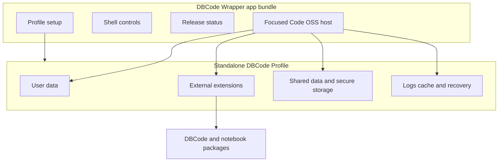

## Summary

The application has two cooperating halves. The app bundle provides a slim Code OSS runtime and small first-party wrapper extensions. A separate Standalone DBCode Profile provides the user's settings, secure-storage identity, installed DBCode package, pinned notebook packages, caches, logs, and recovery state.

This split keeps the wrapper source suitable for the public repository while the built app, licensed DBCode package, credentials, and private profile remain owner-only. It also allows the profile to survive app replacement when a compatible host is installed.

## Diagram

## Key components

- [Host Session](../modules/host-session.md) launches the bundle with the exact profile arguments and observes its lifecycle.
- [Profile Layout and Setup](../modules/profile-layout-and-setup.md) derives and validates every owned path before setup, migration, or recovery.
- [Focused Runtime Setup](../modules/focused-runtime-setup.md) verifies pinned packages before installing them into the external extension root.
- [Focused shell extensions](../modules/focused-shell-extensions.md) render the database-oriented top bar and supporting controls.
- [Approved Release Set](../modules/approved-release-set.md) binds the app and profile contents to the compatibility decision.

The path contract starts in [`profile-layout.js`](https://github.com/alexwck/dbcode-wrapper/blob/efe247fc701a9b529e3e6368b6571a44541fc146/host/extensions/dbcode-wrapper-profile-migration/profile-layout.js). The launch contract is implemented by [`host-session.js`](https://github.com/alexwck/dbcode-wrapper/blob/efe247fc701a9b529e3e6368b6571a44541fc146/script/lib/host-session.js) and its shell adapter.

## Design decisions

- The default personal profile uses stable natural macOS paths; QA and isolated profiles use separate owned roots.
- Mutating operations must prove that every target is inside the expected owner root.
- The app bundle does not contain the licensed DBCode package or the user's profile.
- Normal VS Code profiles are outside the wrapper's ownership boundary.
- Secure-storage prompts are part of macOS identity and signing continuity. Changing app identity or signing material can make the OS treat a launch as a different application.
- Recovery is explicit and conservative: it backs up owned profile data and relaunches with a verified argument set.

## Related

- [Standalone DBCode Profile](../concepts/standalone-dbcode-profile.md)
- [First run, activation, and query](../flows/first-run-activate-and-query.md)
- [Package and transfer a private release](../flows/package-and-transfer-private-release.md)
- [Choose a verification level](../guides/choose-a-verification-level.md)
