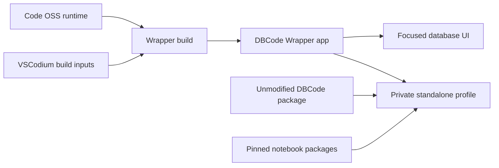

## Summary

DBCode Wrapper is a focused macOS host for the unmodified DBCode extension. It is not a new database engine and it is not meant to expose a general-purpose IDE. The project owns the desktop identity, focused shell, private profile, release contracts, build patches, and verification. Code OSS, the VSCodium build machinery, DBCode, and the pinned notebook runtime remain upstream components.

The public repository contains the wrapper source and reproducible contracts. A Private Personal Release remains host-only; first run obtains verified DBCode and notebook packages into the owner's separate private profile.

## Diagram

## Key components

- [Release Specification](../modules/release-specification.md) gives every consumer the same product and dependency facts.
- [Patch Plan and build](../modules/patch-plan-and-build.md) applies the small, ordered wrapper patch stack to an upstream host.
- [Focused shell extensions](../modules/focused-shell-extensions.md) keep database actions visible while hiding unrelated IDE surfaces.
- [Profile Layout and Setup](../modules/profile-layout-and-setup.md) keeps licensed packages and user state outside the app bundle.
- [Private Personal Release](../modules/private-personal-release.md) packages only material safe for the owner's devices.

The policy boundaries are executable data in [`host/slimming-policy.json`](https://github.com/alexwck/dbcode-wrapper/blob/efe247fc701a9b529e3e6368b6571a44541fc146/host/slimming-policy.json), [`host/dbcode-feature-policy.json`](https://github.com/alexwck/dbcode-wrapper/blob/efe247fc701a9b529e3e6368b6571a44541fc146/host/dbcode-feature-policy.json), and [`host/release-lock.json`](https://github.com/alexwck/dbcode-wrapper/blob/efe247fc701a9b529e3e6368b6571a44541fc146/host/release-lock.json).

## Design decisions

- DBCode remains unmodified. The wrapper integrates through public extension and host behavior rather than copying proprietary implementation.
- The shell removes general IDE affordances, but the feature contract does not restrict DBCode to the databases used by smoke tests. All connection types supported by the approved DBCode package remain in scope.
- PostgreSQL, DuckDB, Parquet, SQLite, and notebooks are representative acceptance paths, not the product's complete database list.
- Upstream versions are treated as one compatibility set. Independent updates are discovered, then built and verified together before approval.
- The public source tree excludes licence keys, credentials, installed extensions, private profiles, release packages, and raw local evidence.

## Related

- [Focused host and private profile](focused-host-and-private-profile.md)
- [Release trust and compatibility](release-trust-and-compatibility.md)
- [Unmodified Extension Boundary](../concepts/unmodified-extension-boundary.md)
- [Build, sign, and launch](../flows/build-sign-and-launch.md)
