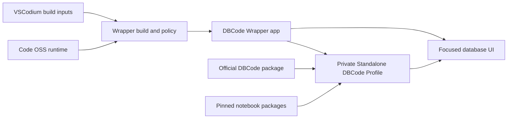

## Summary

DBCode Wrapper is a focused macOS host for the official unmodified DBCode extension. It is not a database engine, a replacement database client, or a general-purpose IDE. The wrapper owns the desktop identity, focused navigation, private Standalone DBCode Profile, build and release contracts, and checks around the integration.

DBCode owns connections, dialects, object browsing, SQL editing, results, data work, notebooks, AI, MCP, accounts, and licences. Code OSS supplies the extension-host runtime, and VSCodium supplies reproducible macOS build machinery.

## Diagram

## Key components

- [Release Specification](../modules/release-specification.md) gives every consumer the same product and dependency facts.
- [Patch Plan and build](../modules/patch-plan-and-build.md) applies the small ordered wrapper patch stack.
- [Focused shell and wrapper extensions](../modules/focused-shell-extensions.md) keep DBCode routes visible while hiding unrelated IDE surfaces.
- [DBCode capability evidence](../concepts/dbcode-capability-evidence.md) records feature breadth without recreating the product.
- [AI and MCP data boundaries](../concepts/ai-and-mcp-data-boundaries.md) keep provider and payload claims precise.
- [Profile Layout and Setup](../modules/profile-layout-and-setup.md) keeps packages and user state outside the app.

The main executable policies are [`host/slimming-policy.json`](https://github.com/alexwck/dbcode-wrapper/blob/2008ff48373c1aac378d0d1ec903e96a88ec1e29/host/slimming-policy.json), [`host/dbcode-feature-policy.json`](https://github.com/alexwck/dbcode-wrapper/blob/2008ff48373c1aac378d0d1ec903e96a88ec1e29/host/dbcode-feature-policy.json), and [`host/release-lock.json`](https://github.com/alexwck/dbcode-wrapper/blob/2008ff48373c1aac378d0d1ec903e96a88ec1e29/host/release-lock.json).

## Design decisions

- DBCode remains unmodified. The wrapper uses public extension and host behaviour instead of copying proprietary implementation.
- Every retained capability keeps at least one DBCode-owned route. A proven-broken wrapper shortcut may be hidden without hiding the underlying feature.
- Feature evidence stays honest: `declared`, `reachable`, `rendered`, and `live` mean different things.
- The complete New Connection catalogue is authoritative. Representative checks are not an allowlist.
- AI and MCP are preserved as DBCode features. The wrapper does not make model calls or external data sharing part of deployment.
- Public source excludes packages, licences, credentials, profiles, apps, DMGs, signing secrets, and raw private evidence.

## Related

- [Focused host and private profile](focused-host-and-private-profile.md)
- [Release trust and compatibility](release-trust-and-compatibility.md)
- [Unmodified Extension Boundary](../concepts/unmodified-extension-boundary.md)
- [Trace a DBCode feature](../guides/trace-a-dbcode-feature.md)