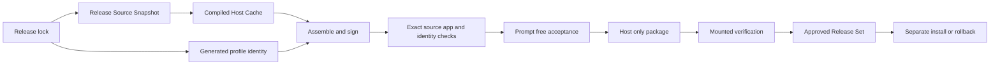

## Summary

A version number is not enough to approve a release. DBCode Wrapper treats the immutable wrapper source, Code OSS and VSCodium inputs, compiled host, generated profile identity, DBCode and notebook packages, signed app, and acceptance evidence as one compatibility unit.

The design keeps deployment fast. Every release gets a new auditable source snapshot and final artifact, but unchanged Code OSS compilation can come from a verified content-addressed cache. Profile-only identity changes happen during assembly; only values embedded in the host invalidate compilation. The default acceptance path is automated and prompt-free.

## Diagram

## Key components

- [Release Specification](../modules/release-specification.md) validates and projects the canonical lock.
- [Release Source Snapshot](../modules/release-source-snapshot.md) binds one clean commit to the release.
- [Compiled Host Cache](../modules/compiled-host-cache.md) reuses unchanged compilation safely.
- [Profile Layout and Setup](../modules/profile-layout-and-setup.md) validates the generated profile identity before profile work.
- [Approved Release Set](../modules/approved-release-set.md) validates approved history, exact update matches, and prompt-free approval identities.
- [Verification Harness](../modules/verification-harness.md) reruns source contracts and static smoke against the exact release inputs.
- [Private Personal Release](../modules/private-personal-release.md) binds an annotated source tag and final acceptance to the host-only package.

Core transition checks live in [`release_specification.sh`](https://github.com/alexwck/dbcode-wrapper/blob/ddaa6a0b7b906af9994221e98ca8f0a0ef3c93b1/script/lib/release_specification.sh), [`release_source_snapshot.sh`](https://github.com/alexwck/dbcode-wrapper/blob/ddaa6a0b7b906af9994221e98ca8f0a0ef3c93b1/script/lib/release_source_snapshot.sh), [`compiled_host_cache.sh`](https://github.com/alexwck/dbcode-wrapper/blob/ddaa6a0b7b906af9994221e98ca8f0a0ef3c93b1/script/lib/compiled_host_cache.sh), and [`private_release.sh`](https://github.com/alexwck/dbcode-wrapper/blob/ddaa6a0b7b906af9994221e98ca8f0a0ef3c93b1/script/lib/private_release.sh).

## Design decisions

- Update discovery is advisory. It cannot approve or install a release.
- Accepted source tags are immutable and must identify the commit that built the app.
- The compiled-host ID changes only when real compilation inputs change.
- Profile-only names and profile schema stay in assembly; query storage names change compilation because the shell embeds them.
- Assembly always creates fresh profile, runtime, release, signature, manifest, and release identity records.
- Static smoke regenerates and compares the packaged profile identity before any rendered launch.
- Final acceptance re-enters the manifest's materialized source and reruns development and static checks.
- The rendered report is reusable only for the same exact release-set ID.
- Human prompts and external services are normal app-use gates, not deployment tests.
- One persistent generated `qa` profile owns automated GUI checks.
- Prompt-free approval writes generated evidence only. It never installs the app or writes the production profile.
- The previous complete set stays protected for rollback. Its own current or historical Release Specification provides the retained app and bundle identity.

## Related

- [Approved Release Set](../concepts/approved-release-set.md)
- [Review an upstream update](../guides/review-an-upstream-update.md)
- [Build, sign, and launch](../flows/build-sign-and-launch.md)
- [Approval and guarded rollback](../flows/approval-and-guarded-rollback.md)
- [Package and transfer a private release](../flows/package-and-transfer-private-release.md)