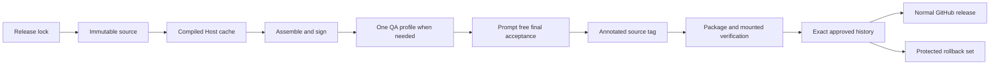

## Summary

A version number is not enough to approve a release. DBCode Wrapper treats the immutable wrapper source, Code OSS and VSCodium inputs, compiled host, profile identity, DBCode and notebook packages, signed app, acceptance evidence, mounted DMG, approval record, and public digests as one compatibility unit.

The design keeps deployment fast. Normal source checks are prompt-free and finish well below one minute. Unchanged Code OSS compilation can use a verified content-addressed cache. The owner-facing release task reuses existing evidence only after exact validation.

## Diagram

## Key components

- [Release Specification](../modules/release-specification.md) validates canonical identity and distribution policy.
- [Release Source Snapshot](../modules/release-source-snapshot.md) binds one clean commit to the build.
- [Compiled Host Cache](../modules/compiled-host-cache.md) reuses unchanged compilation safely.
- [Verification Harness](../modules/verification-harness.md) chooses the smallest prompt-free gate for the changed boundary.
- [Host Release](../modules/host-release.md) derives paths and orders acceptance, tag, package, approval, history, and publication.
- [Approved Release Set](../modules/approved-release-set.md) validates the exact approval and tracked history.

Core checks live in [release_host.sh](https://github.com/alexwck/dbcode-wrapper/blob/afc5fe7666bf88007bcf4956f05928e3d93c8e2f/script/release_host.sh), [release_specification.sh](https://github.com/alexwck/dbcode-wrapper/blob/afc5fe7666bf88007bcf4956f05928e3d93c8e2f/script/lib/release_specification.sh), [release_source_snapshot.sh](https://github.com/alexwck/dbcode-wrapper/blob/afc5fe7666bf88007bcf4956f05928e3d93c8e2f/script/lib/release_source_snapshot.sh), [compiled_host_cache.sh](https://github.com/alexwck/dbcode-wrapper/blob/afc5fe7666bf88007bcf4956f05928e3d93c8e2f/script/lib/compiled_host_cache.sh), and [approved_release_set.sh](https://github.com/alexwck/dbcode-wrapper/blob/afc5fe7666bf88007bcf4956f05928e3d93c8e2f/script/lib/approved_release_set.sh).

## Design decisions

- Automatic polling and update status are advisory. They cannot change pins, approve, tag, publish, or install.
- Complete acceptance must pass before a new annotated tag is created.
- One persistent generated `qa` profile owns automated rendered checks.
- Reused evidence must still match the exact manifest, lock, tag, records, flags, timestamps, and digests.
- Approval does not install the app or write the production profile.
- Approval history is one small tracked change that the owner commits before publication.
- Publication requires an explicit flag and creates a normal release in this repository.
- Human prompts and external services are app-use gates, not deployment tests.
- The previous complete set stays protected for rollback.

## Related

- [Approved Release Set](../concepts/approved-release-set.md)
- [Review an upstream update](../guides/review-an-upstream-update.md)
- [Build, sign, and launch](../flows/build-sign-and-launch.md)
- [Approval and guarded rollback](../flows/approval-and-guarded-rollback.md)
- [Package and publish a Host Release](../flows/package-and-publish-host-release.md)