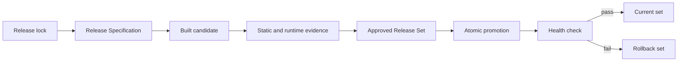

## Summary

A working version number is not enough to approve a release. DBCode Wrapper treats the Code OSS host, VSCodium source and patches, DBCode extension, notebook packages, profile schema, wrapper code, and acceptance evidence as one compatibility unit.

The trust model is staged: declare the expected inputs, build a candidate, verify its identity and behavior, record approval, promote the complete set, and retain a complete prior set for rollback.

## Diagram

## Key components

- [Release Specification](../modules/release-specification.md) validates and projects the canonical release lock.
- [Approved Release Set](../modules/approved-release-set.md) validates prepared and approved records and binds them to evidence digests.
- [Verification Harness](../modules/verification-harness.md) supplies layered static, contract, rendered, database, persistence, and release checks.
- [Private Personal Release](../modules/private-personal-release.md) verifies signed packaging and sanitized metadata.
- [Controlled upgrade and rollback](../flows/controlled-upgrade-and-rollback.md) stages and switches the whole app/profile set.

The core schemas and transition checks are in [`release_specification.sh`](https://github.com/alexwck/dbcode-wrapper/blob/efe247fc701a9b529e3e6368b6571a44541fc146/script/lib/release_specification.sh), [`approved-release-set.js`](https://github.com/alexwck/dbcode-wrapper/blob/efe247fc701a9b529e3e6368b6571a44541fc146/host/extensions/dbcode-wrapper-release-status/approved-release-set.js), and [`controlled_upgrade.sh`](https://github.com/alexwck/dbcode-wrapper/blob/efe247fc701a9b529e3e6368b6571a44541fc146/script/controlled_upgrade.sh).

## Design decisions

- Update discovery is advisory. It can point to newer upstream releases, but it cannot approve or install them.
- Candidate preparation is separate from promotion. This gives the owner time to run representative checks before changing the active app.
- Approval records contain identities and digests, not secrets or mutable local paths.
- Promotion and rollback cover the app, manifest, user data, extensions, and shared data as one set.
- Legacy records may be readable for continuity, while new approvals use the deeper current schema.
- The strongest confidence comes from a real signed app, a real standalone profile, full quit/relaunch, and representative database workflows.

## Related

- [Approved Release Set](../concepts/approved-release-set.md)
- [Review an upstream update](../guides/review-an-upstream-update.md)
- [Build, sign, and launch](../flows/build-sign-and-launch.md)
- [Package and transfer a private release](../flows/package-and-transfer-private-release.md)
