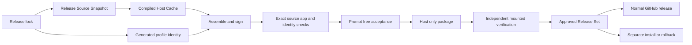

## Summary

A version number is not enough to approve a release. DBCode Wrapper treats the immutable wrapper source, Code OSS and VSCodium inputs, compiled host, generated profile identity, DBCode and notebook packages, signed app, acceptance evidence, final DMG, and public asset digests as one compatibility unit.

The design keeps deployment fast. Every release gets a new auditable source snapshot and final artifact, but unchanged Code OSS compilation can come from a verified content-addressed cache. The default acceptance path is automated and prompt-free.

## Diagram

## Key components

- [Release Specification](../modules/release-specification.md) validates and projects the canonical lock, including public distribution policy.
- [Release Source Snapshot](../modules/release-source-snapshot.md) binds one clean commit to the release.
- [Compiled Host Cache](../modules/compiled-host-cache.md) reuses unchanged compilation safely.
- [Profile Layout and Setup](../modules/profile-layout-and-setup.md) validates generated profile identity before profile work.
- [Approved Release Set](../modules/approved-release-set.md) validates history, exact update matches, and prompt-free approval.
- [Verification Harness](../modules/verification-harness.md) reruns source contracts and static smoke against the exact release inputs.
- [Host Release](../modules/host-release.md) packages, verifies, approves, and publishes the host-only release.

Core transition checks live in [release_specification.sh](https://github.com/alexwck/dbcode-wrapper/blob/e02160a3b5363fc4e91c5282f7818ed908624c6d/script/lib/release_specification.sh), [release_source_snapshot.sh](https://github.com/alexwck/dbcode-wrapper/blob/e02160a3b5363fc4e91c5282f7818ed908624c6d/script/lib/release_source_snapshot.sh), [compiled_host_cache.sh](https://github.com/alexwck/dbcode-wrapper/blob/e02160a3b5363fc4e91c5282f7818ed908624c6d/script/lib/compiled_host_cache.sh), and [host_release.sh](https://github.com/alexwck/dbcode-wrapper/blob/e02160a3b5363fc4e91c5282f7818ed908624c6d/script/lib/host_release.sh).

## Design decisions

- Automatic polling and the update-status UI are advisory. They cannot change pins, approve, tag, publish, or install a release.
- Accepted source tags are immutable and must identify the commit that built the app.
- The compiled-host ID changes only when real compilation inputs change.
- Profile-only names and schema stay in assembly; query storage names change compilation because the shell embeds them.
- Final acceptance re-enters the manifest's materialized source and reruns development and static checks.
- One persistent generated `qa` profile owns automated GUI checks.
- The packager performs one full validation and creates one digest-bound release context.
- The staging copy may reuse that context only while its exact app checks still match.
- The mounted-DMG verifier creates its own full context and does not trust the staging shortcut.
- Prompt-free approval writes generated evidence only. It never installs the app or writes the production profile.
- Publication uploads only the DMG and checksum as a normal release, then checks public state, sizes, and digests.
- Human prompts and external services are normal app-use gates, not deployment tests.
- The previous complete set stays protected for rollback. Historical release records remain readable without defining a new candidate.

## Related

- [Approved Release Set](../concepts/approved-release-set.md)
- [Review an upstream update](../guides/review-an-upstream-update.md)
- [Build, sign, and launch](../flows/build-sign-and-launch.md)
- [Approval and guarded rollback](../flows/approval-and-guarded-rollback.md)
- [Package and publish a Host Release](../flows/package-and-publish-host-release.md)
- [Historical private transfer](../flows/package-and-transfer-private-release.md)
