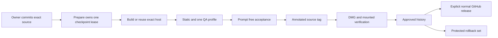

## Summary

A version number is not enough to approve a release. DBCode Wrapper treats the immutable wrapper source, pinned upstream inputs, compiled host, signed app, profile identity, acceptance evidence, mounted DMG, approval record, and public digests as one compatibility unit.

The release path stays short. One owner-facing `prepare` task checks signing readiness, builds or reuses the exact host, runs static and one-profile rendered checks, performs final acceptance, tags, packages, verifies, and records approval. Publication remains a separate explicit action.

## Diagram

## Key components

- [Release Specification](../modules/release-specification.md) validates canonical identity and distribution policy.
- [Release Source Snapshot](../modules/release-source-snapshot.md) binds one clean commit to the build.
- [Compiled Host Cache](../modules/compiled-host-cache.md) reuses unchanged Code OSS compilation.
- [Patch Plan and build](../modules/patch-plan-and-build.md) owns immutable-source assembly and the complete `dist/` checkpoint.
- [Verification Harness](../modules/verification-harness.md) keeps prompt-free development and release checks focused.
- [Host Release](../modules/host-release.md) owns preparation, exact resume, approval recording, and explicit publication.
- [Approved Release Set](../modules/approved-release-set.md) validates the exact approval and tracked history.

Core checks live in [release_host.sh](https://github.com/alexwck/dbcode-wrapper/blob/2191402c377a4caa9c941af83c6cbcf6c0d41809/script/release_host.sh), [dist_checkpoint.sh](https://github.com/alexwck/dbcode-wrapper/blob/2191402c377a4caa9c941af83c6cbcf6c0d41809/script/lib/dist_checkpoint.sh), [release_source_snapshot.sh](https://github.com/alexwck/dbcode-wrapper/blob/2191402c377a4caa9c941af83c6cbcf6c0d41809/script/lib/release_source_snapshot.sh), [compiled_host_cache.sh](https://github.com/alexwck/dbcode-wrapper/blob/2191402c377a4caa9c941af83c6cbcf6c0d41809/script/lib/compiled_host_cache.sh), and [approved_release_set.sh](https://github.com/alexwck/dbcode-wrapper/blob/2191402c377a4caa9c941af83c6cbcf6c0d41809/script/lib/approved_release_set.sh).

## Design decisions

- Automatic polling is advisory. It cannot change pins, approve, tag, publish, or install.
- `prepare` is the only normal preparation checklist; lower-level commands are diagnostics.
- A kernel-backed lease covers `dist/` for the full lifetime of build and verification children.
- Assembly promotes one complete staged app and manifest. Fixed candidate and previous paths make interruption recoverable.
- Complete acceptance passes before a new annotated tag is created.
- One persistent generated `qa` profile owns automated rendered checks.
- Existing assets and approval are reused only after exact file, identity, and digest validation.
- Approval does not install the app or write the production profile.
- Publication requires an explicit flag and creates a normal release in this repository.
- Human prompts and external services are app-use gates, not deployment tests.

## Related

- [Approved Release Set](../concepts/approved-release-set.md)
- [Prompt-free acceptance boundary](../concepts/representative-acceptance-fixtures.md)
- [Build, sign, and launch](../flows/build-sign-and-launch.md)
- [Approval and guarded rollback](../flows/approval-and-guarded-rollback.md)
- [Package and publish a Host Release](../flows/package-and-publish-host-release.md)