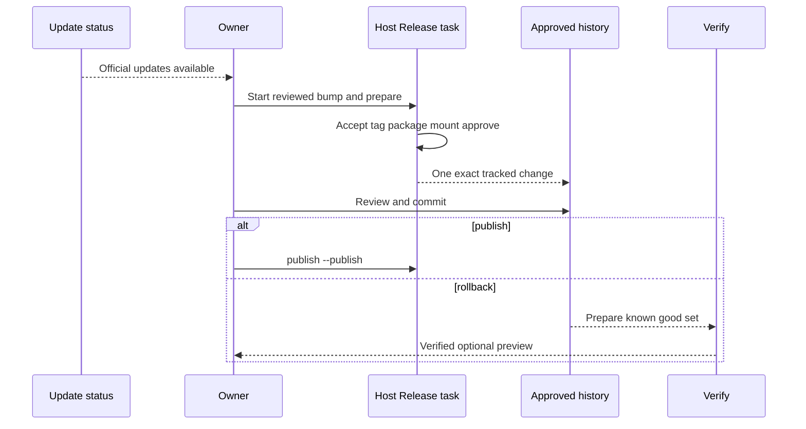

## Summary

Automatic update discovery reports candidates but never promotes or installs them. A release becomes approved only after exact-source acceptance, the required one-profile rendered evidence, Host Release packaging, mounted verification, and deep approval validation identify the same set.

Preparation writes generated approval evidence and one tracked history change. It does not install the app or write the production profile. The owner reviews and commits the history change before publishing.

The previous known-good release stays protected. Rollback tools prepare it from approved history, verify its digests and signature, and may preview it with a disposable profile. Installation or restoration remains an explicit owner action.

## Trigger

Start when the repository owner chooses a discovered update for review, or needs to inspect a known-good rollback set.

## Sequence diagram

## Steps

1. Review official changes and update the Release Specification and only affected policy.
2. Build once from clean immutable source, reusing the [Compiled Host Cache](../modules/compiled-host-cache.md) when valid.
3. Produce the required static and one-profile rendered evidence.
4. Run `./script/release_host.sh prepare`.
5. Let the task validate acceptance before tag creation, then package, mount, verify, approve, and record.
6. Review and commit `host/approved-release-history.json`.
7. Publish separately with the explicit flag, or keep the approved set only as rollback evidence.
8. For rollback, validate the retained lock through its strict current or read-only historical adapter.
9. Verify every retained digest and signature, then optionally preview with a disposable profile.
10. Fully quit the app before any owner-controlled install or restore.

## Failure modes

- Discovery reports a version but no exact approved release exists.
- Source, cache, app, manifest, rendered evidence, package, or approval identify different sets.
- Approval claims installation, production-profile changes, or privileged actions.
- Tracked history differs from the deeply validated candidate.
- Rollback material does not match approved history, signatures, or stored digests.

## Related

- [Release trust and compatibility](../architecture/release-trust-and-compatibility.md)
- [Approved Release Set](../modules/approved-release-set.md)
- [Host Release](../modules/host-release.md)
- [Generated Workspace Retention](../modules/generated-workspace-retention.md)
- [Review an upstream update](../guides/review-an-upstream-update.md)