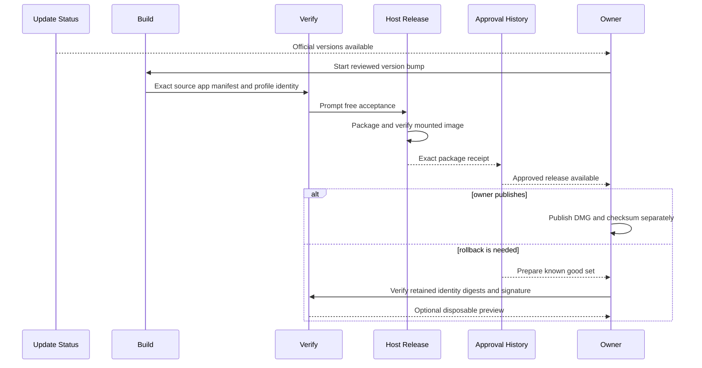

## Summary

Automatic update discovery reports candidates but never installs or promotes them. A release becomes approved only after exact-source checks, one persistent-profile rendered check, Host Release packaging, and independent mounted verification identify the same release set. Approval writes generated records; it does not install the app or change the production profile.

The previous known-good release stays protected. Rollback tools can prepare it from approved history, verify its digests and signature, and preview it with a disposable profile. Historical locks use their own read-only [Release Specification](../modules/release-specification.md) path.

## Trigger

Start when the repository owner chooses a discovered update for review, or needs to inspect a known-good rollback set.

## Sequence diagram

## Steps

1. Review official changes and update the Release Specification and only affected policy.
2. Finish release work, then build once from a clean immutable source commit.
3. Reuse the [Compiled Host Cache](../modules/compiled-host-cache.md) when compilation inputs are unchanged.
4. Run exact-source development checks, static smoke, and matching one-profile rendered smoke.
5. Package and independently verify the host-only image through [Host Release](../modules/host-release.md).
6. Write approval only when source, app, extension, profile, acceptance, and package identities match.
7. Keep publication and installation separate from approval and production-profile changes.
8. For rollback, validate the retained lock through its strict current or read-only historical adapter.
9. Verify every retained digest and signature, then optionally preview with a disposable profile.
10. Fully quit the app before any owner-controlled install or restore.

## Failure modes

- Discovery has a newer version but no approved release set.
- Source, cache receipt, app, profile identity, manifest, rendered evidence, or package receipt identify different releases.
- The package includes DBCode, profile data, credentials, or another forbidden private asset.
- Approval would overwrite evidence, install the app, or write the production profile.
- A rollback lock is missing, malformed, unsupported, or not bound to its retained manifest.
- A rollback set does not match approved history, signature, or stored digests.

## Related

- [Release trust and compatibility](../architecture/release-trust-and-compatibility.md)
- [Profile Layout and Setup](../modules/profile-layout-and-setup.md)
- [Approved Release Set](../modules/approved-release-set.md)
- [Host Release](../modules/host-release.md)
- [Generated Workspace Retention](../modules/generated-workspace-retention.md)
- [Review an upstream update](../guides/review-an-upstream-update.md)
