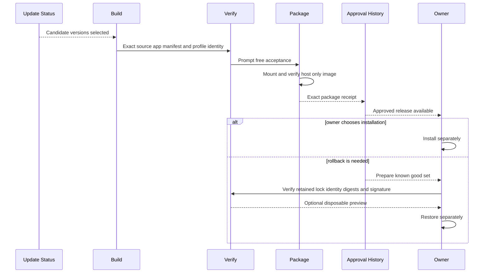

## Summary

Update discovery reports candidates but never installs them. A release becomes approved only after exact-source checks, one persistent-profile rendered check, host-only packaging, and independent mounted verification identify the same release set. Approval writes generated records; it does not install the app or change the personal profile.

The previous known-good release stays protected. Rollback tools can prepare it from approved history, verify its digests and signature, and preview it with a disposable profile. The verifier reads the retained app name and bundle identifier from that release's own current or historical [Release Specification](../modules/release-specification.md), not from today's product constants.

## Trigger

Start this flow when an upstream update is ready for review, or when the owner needs to inspect a known-good rollback set.

## Sequence diagram

## Steps

1. Review official changes and update the release lock, feature policy, and patches.
2. Finish release work, then build once from a clean immutable source commit.
3. Reuse the [Compiled Host Cache](../modules/compiled-host-cache.md) when compilation inputs are unchanged.
4. Run exact-source development checks, static smoke, and the matching one-profile rendered smoke.
5. Package and independently verify the host-only image.
6. Write approval only when source, app, extension, profile, acceptance, and package identities match exactly.
7. Keep installation separate from approval and production-profile changes.
8. For rollback, validate the retained release lock through its strict current or read-only historical adapter.
9. Derive the retained app and bundle identity from that record, then verify every retained digest and signature.
10. Optionally preview the retained app with a disposable profile without replacing the current app.
11. Fully quit the app before any owner-controlled install or restore.

The retired four-pair compatibility, controlled-promotion, manual proof, and real-profile health harnesses are historical evidence only. They are not deployment steps and their generated output remains protected.

## Failure modes

- Discovery has a newer version but no approved release set.
- Source, cache receipt, app, profile identity, manifest, rendered evidence, or package receipt identify different releases.
- The package includes DBCode, profile data, credentials, or another forbidden private asset.
- Approval would replace an existing generated bundle or write the installed app or production profile.
- A rollback lock is missing, malformed, or unsupported.
- A rollback app path or bundle identifier does not match its own retained Release Specification.
- A rollback set does not match approved history, its build manifest, signature, or stored digests.
- A rollback path is outside its registered protected root.

## Related

- [Release trust and compatibility](../architecture/release-trust-and-compatibility.md)
- [Profile Layout and Setup](../modules/profile-layout-and-setup.md)
- [Approved Release Set](../modules/approved-release-set.md)
- [Private Personal Release](../modules/private-personal-release.md)
- [Generated Workspace Retention](../modules/generated-workspace-retention.md)
- [Review an upstream update](../guides/review-an-upstream-update.md)