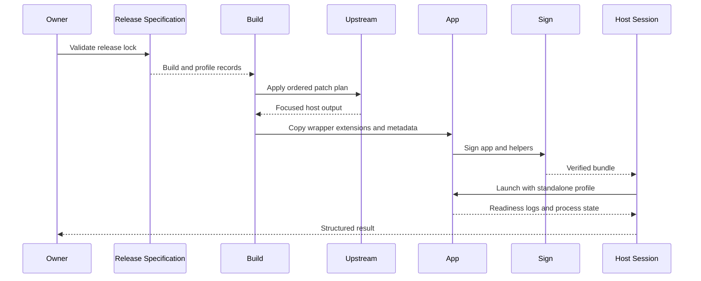

## Summary

This flow creates the app without permanently vendoring the upstream source trees. The release lock selects the compatible inputs; the patch plan turns them into the focused host; signing preserves the macOS identity; Host Session launches the app with the intended profile and records a structured result.

## Trigger

Run this flow when creating the first local build or when any approved host input, patch, product identity, wrapper extension, or signing material changes.

## Sequence diagram

## Steps

1. Validate [`host/release-lock.json`](https://github.com/alexwck/dbcode-wrapper/blob/fbf29827376fd0ea5867082b78e38862878f42b6/host/release-lock.json) through [Release Specification](../modules/release-specification.md).
2. Resolve and validate the ordered plan from [`patch-plan.json`](https://github.com/alexwck/dbcode-wrapper/blob/fbf29827376fd0ea5867082b78e38862878f42b6/host/patches/patch-plan.json).
3. Resolve worktrees, generated source, caches, and toolchains through [Generated Workspace Retention](../modules/generated-workspace-retention.md).
4. Build the pinned VSCodium and Code OSS sources with the slimming policy and focused-shell patches.
5. Copy the wrapper-owned extensions and generated runtime/release records into the bundle.
6. Sign the main app and required helpers with one stable local identity.
7. Inspect the bundle, signing, and expected extension inventory.
8. Launch through [Host Session](../modules/host-session.md) using a validated profile layout.
9. Record readiness, fatal-log, process-tree, and shutdown evidence under its registered evidence root.

## Failure modes

- A patch no longer applies after an upstream source change.
- A source or generated record disagrees with the release lock.
- A removed built-in extension reappears or a required one is missing.
- App and helper signatures do not form the expected identity.
- macOS secure storage prompts again because the bundle or signing identity changed.
- The renderer starts but DBCode activation or the extension host reports a fatal error.
- A stale process makes the lifecycle check observe the wrong app instance.
- A caller writes generated output outside its registered root or attempts to reuse a path through a symbolic link.

## Related

- [Patch Plan and build](../modules/patch-plan-and-build.md)
- [Generated Workspace Retention](../modules/generated-workspace-retention.md)
- [Focused host and private profile](../architecture/focused-host-and-private-profile.md)
- [Choose a verification level](../guides/choose-a-verification-level.md)
