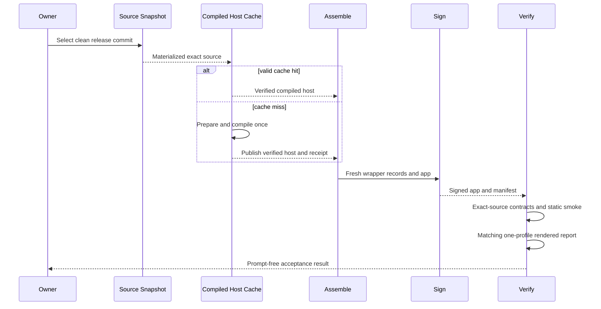

## Summary

This flow creates a fresh auditable release without recompiling an unchanged host. The build records and materializes one clean source commit, reuses or creates the exact compiled-host cache entry, assembles wrapper records and extensions, signs the app, and generates the manifest. Static and rendered checks then verify the exact release.

## Trigger

Run this flow when creating a release candidate after all release-bound source changes are complete. A real compilation happens only when compilation inputs changed.

## Sequence diagram

## Steps

1. Resolve a clean release ref and create a [Release Source Snapshot](../modules/release-source-snapshot.md).
2. Materialize that commit in a narrow temporary checkout.
3. Validate [Release Specification](../modules/release-specification.md) and the ordered patch plan.
4. Calculate the [Compiled Host Cache](../modules/compiled-host-cache.md) input ID from content and Git's regular-or-executable file state.
5. Reuse a verified cache entry, or prepare and compile the pinned upstream host once.
6. Copy wrapper extensions and generate runtime and release-status records.
7. Sign the app and generate a manifest containing source, compiled-host, app, and release identities.
8. Run static smoke against the exact signed app.
9. Run or reuse the one-profile rendered smoke only when its release-set ID matches.
10. Run final acceptance from the manifest's materialized source.

## Failure modes

- The selected release source is dirty or changes during the build.
- A patch no longer applies after an upstream change.
- A cache receipt or app digest does not match the current compilation ID.
- The release lock, generated records, app, and manifest identify different sets.
- Signing identity or helper signatures drift.
- The rendered report belongs to another release-set ID.
- A prompt-prone action enters the automated deployment path.

## Related

- [Patch Plan and build](../modules/patch-plan-and-build.md)
- [Release trust and compatibility](../architecture/release-trust-and-compatibility.md)
- [Verification Harness](../modules/verification-harness.md)
- [Generated Workspace Retention](../modules/generated-workspace-retention.md)