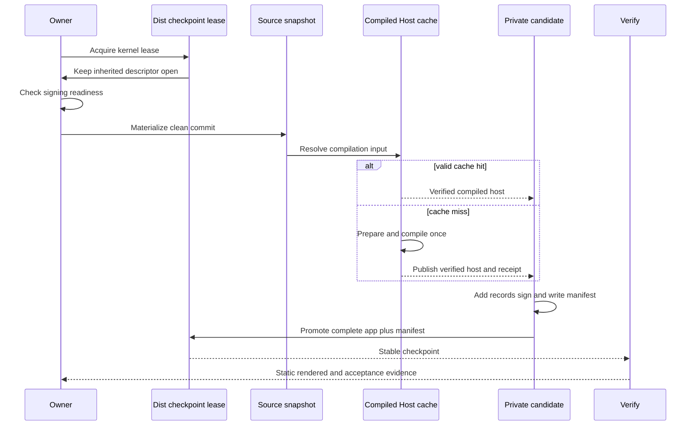

## Summary

This flow creates a fresh auditable host without recompiling unchanged Code OSS. It records and materializes one clean source commit, reuses or creates the exact Compiled Host cache entry, assembles wrapper records, signs the staged app, and promotes the app and manifest as one complete `dist/` checkpoint.

The build checks signing readiness before assembly. A kernel-backed lease stays open in every child process, so another build or reader cannot replace the checkpoint halfway through work.

## Trigger

`release_host.sh prepare` owns this flow for a release. Run `build_host.sh` directly only for development or diagnosis.

## Sequence diagram

## Steps

1. Acquire or inherit the maintained `dist/` lease.
2. Check the existing signing identity without changing trust or prompting.
3. Create and materialize a [Release Source Snapshot](../modules/release-source-snapshot.md).
4. Validate the [Release Specification](../modules/release-specification.md) and ordered Patch Plan.
5. Reuse a verified [Compiled Host Cache](../modules/compiled-host-cache.md) entry, or compile once.
6. Create the fixed private candidate and add wrapper extensions and generated records.
7. Sign the complete app and write its exact manifest in the candidate.
8. Promote the app and manifest together. Keep the previous complete checkpoint until promotion succeeds.
9. Run static smoke and one matching persistent-profile rendered smoke.
10. Run final acceptance from the manifest's materialized source.

## Failure modes

- Signing readiness fails before assembly.
- The selected source is dirty or changes during materialization.
- A patch no longer applies after an upstream change.
- A cache receipt or digest does not match the current input ID.
- Another build or reader already owns the checkpoint lease.
- Stage creation, signing, manifest generation, or promotion fails.
- A parent exits while a child still works; the child keeps the lease until it exits.
- The rendered report belongs to another release-set ID.
- A prompt-prone action enters automated deployment.

## Related

- [Patch Plan and build](../modules/patch-plan-and-build.md)
- [Host Release](../modules/host-release.md)
- [Release trust and compatibility](../architecture/release-trust-and-compatibility.md)
- [Verification Harness](../modules/verification-harness.md)
- [Generated Workspace Retention](../modules/generated-workspace-retention.md)