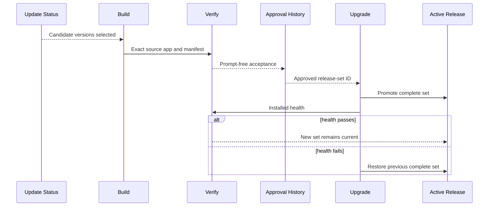

## Summary

Updates are discovered independently but installed as one exact tested set. The flow builds or assembles a candidate beside the active release, runs prompt-free acceptance, records approval, and promotes the app and owned profile members together. The previous complete set remains available for rollback.

## Trigger

Start when update discovery reports a candidate, wrapper release inputs change, or the owner chooses to install an already approved set.

## Sequence diagram

## Steps

1. Review official changes and update the release lock, feature policy, and patches.
2. Finish release-bound work, then build once from a clean immutable source commit.
3. Reuse the [Compiled Host Cache](../modules/compiled-host-cache.md) when compilation inputs are unchanged.
4. Run exact-source development checks, static smoke, and the matching one-profile rendered smoke.
5. Create an approved record only when all source, compiled-host, app, extension, and evidence identities match.
6. Prepare owned profile members and restore only exact verified packages.
7. Stop the app and promote app, manifest, user data, extensions, and shared data as one transaction.
8. Run installed health checks.
9. Restore the recorded previous set if health fails or the new release later proves unusable.

## Failure modes

- Discovery has a newer version but no approved complete set.
- Source, cache receipt, app, manifest, or rendered evidence identify different releases.
- The source profile changes during candidate preparation.
- Package inventory is incomplete or unverified.
- Promotion is interrupted and transaction recovery is required.
- Current files no longer match the rollback safety assertions.
- A staging or rollback path is outside its registered protected root.

## Related

- [Release trust and compatibility](../architecture/release-trust-and-compatibility.md)
- [Approved Release Set](../modules/approved-release-set.md)
- [Release Source Snapshot](../modules/release-source-snapshot.md)
- [Generated Workspace Retention](../modules/generated-workspace-retention.md)
- [Review an upstream update](../guides/review-an-upstream-update.md)