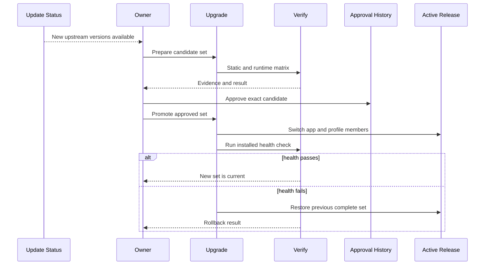

## Summary

Updates are discovered independently but installed as one tested set. The flow prepares a candidate beside the active release, copies the profile into owned staging, restores only verified packages, runs the required matrix, records approval, and then promotes the app and profile together. The previous complete set remains available for rollback.

## Trigger

Start when update discovery reports a newer VSCodium, Code OSS, DBCode, or pinned runtime package, or when wrapper code changes require a new release set.

## Sequence diagram

## Steps

1. Review official release notes and update the canonical release lock and patch plan.
2. Build and sign the candidate without changing the active app.
3. Run `prepare-set` in [`controlled_upgrade.sh`](https://github.com/alexwck/dbcode-wrapper/blob/fbf29827376fd0ea5867082b78e38862878f42b6/script/controlled_upgrade.sh). It resolves the registered controlled-upgrade evidence root, clones owned profile data, and verifies that the source did not change during the copy.
4. Restore only the exact DBCode and notebook packages required by the candidate release specification.
5. Run static, launch, quit, relaunch, database, persistence, signing, and release gates appropriate to the change.
6. Create an approved record only after the evidence matches the candidate.
7. Stop the app and promote the app, manifest, user data, extensions, and shared data as one transaction.
8. Run installed health checks against the promoted set.
9. If health fails or the new release later proves unusable, restore the recorded previous complete set with the explicit release-set confirmation. Rollback worktrees and approved backups remain protected until the rollback workflow explicitly releases them.

## Failure modes

- An update is available but no approved combination contains the complete version tuple.
- The source profile changes during candidate preparation.
- A package cannot be verified or the installed inventory is not exact.
- The acceptance matrix omits a required proof or records inconsistent identities.
- Promotion is interrupted between member moves. The transaction journal must drive recovery.
- The active app or profile changes before rollback, so the safety assertions refuse to overwrite it.
- A rollback restores files but fails post-restore health; the journal records incomplete recovery for manual inspection.
- A staging, receipt, or rollback path is outside its registered root or crosses a symbolic link, so retention validation refuses the operation.

## Related

- [Release trust and compatibility](../architecture/release-trust-and-compatibility.md)
- [Approved Release Set](../modules/approved-release-set.md)
- [Generated Workspace Retention](../modules/generated-workspace-retention.md)
- [Review an upstream update](../guides/review-an-upstream-update.md)
