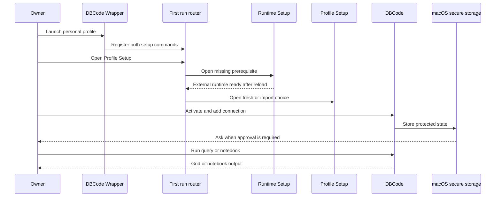

## Summary

The first personal launch turns an empty owned profile into a usable DBCode environment. Runtime Setup and Profile Setup are registered immediately. If the package set is missing, either setup route leads to the verified runtime prerequisite before Profile Setup offers fresh or reviewed-import choices.

This is normal app setup, not the automated deployment test. Deployment checks prove command reachability and safe routing without entering secrets, accepting terms, starting a kernel, or waiting for a person.

## Trigger

Run after a clean personal installation, on another owned Mac, or after an explicitly confirmed profile recreation.

## Sequence diagram

## Steps

1. [Profile Layout and Setup](../modules/profile-layout-and-setup.md) validates personal paths and registers both setup routes.
2. [Focused Runtime Setup](../modules/focused-runtime-setup.md) acquires and verifies DBCode plus pinned Python and Jupyter packages when they are missing.
3. Profile Setup uses the shared fail-closed webview policy and offers a fresh profile or reviewed import.
4. The owner enters their DBCode licence. It is never embedded in source or the host-only package.
5. DBCode creates connections from its complete supported catalogue.
6. The owner handles any Keychain, Safe Storage, account, or kernel prompt.
7. Queries and notebooks run in DBCode-owned surfaces when the owner chooses.

## Failure modes

- Runtime configuration fails; both commands remain registered and show a sanitized error.
- Open VSX metadata, digest, signature, archive identity, or public-key binding fails.
- The extension root is outside the owned profile or its installed inventory is not exact.
- A required user permission is denied.
- A database, network, credential, file, or account is unavailable.
- DBCode contributions are incompatible with the host.

## Related

- [Standalone DBCode Profile](../concepts/standalone-dbcode-profile.md)
- [Prompt-free acceptance boundary](../concepts/representative-acceptance-fixtures.md)
- [AI and MCP data boundaries](../concepts/ai-and-mcp-data-boundaries.md)
- [Trace a DBCode feature](../guides/trace-a-dbcode-feature.md)