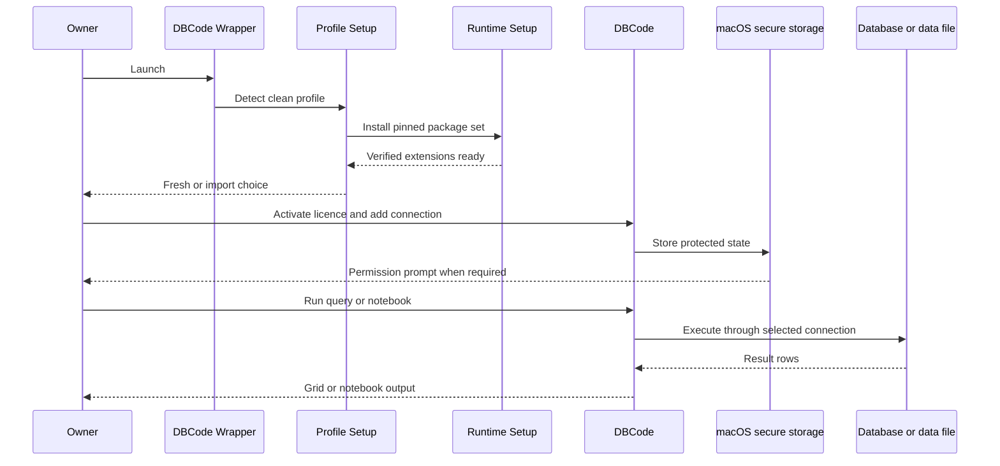

## Summary

The first launch turns an empty owned profile into a usable DBCode environment. It verifies and installs the pinned external extension set, lets the owner activate their DBCode licence, creates or imports connections, and proves that queries and notebook execution work through the focused shell.

## Trigger

Run after a clean installation, on another personally owned Mac, or after an explicitly confirmed profile recreation.

## Sequence diagram

## Steps

1. [Profile Layout and Setup](../modules/profile-layout-and-setup.md) validates the standalone paths before changing anything.
2. [Focused Runtime Setup](../modules/focused-runtime-setup.md) acquires and verifies DBCode plus the complete pinned Python/Jupyter package set.
3. The owner chooses a fresh profile or reviews an import from an explicitly selected source.
4. The owner enters their DBCode licence. The repository and release package never embed it.
5. DBCode creates connections for any database type supported by the approved extension. The acceptance suite's PostgreSQL, SQLite, DuckDB, and Parquet examples are only representative.
6. macOS may request Keychain access the first time a stable app identity uses secure storage. Notebook execution may separately request kernel access.
7. A query or notebook is executed and its actual result is checked in DBCode's own grid or notebook surface.
8. The app is fully quit and relaunched. Licence state, connections, credentials, and query functionality are checked again.

## Failure modes

- Open VSX metadata, digest, signature, archive identity, or public-key binding fails.
- The extension root is outside the owned profile or contains an unexpected pinned version.
- The owner denies a required macOS secure-storage or kernel permission.
- A database service is stopped or its host, port, username, password, or file path is wrong.
- DBCode activates but its command or editor registration is incompatible with the host version.
- State works only before quit, showing that persistence or app identity is broken.

## Related

- [Standalone DBCode Profile](../concepts/standalone-dbcode-profile.md)
- [Representative acceptance fixtures](../concepts/representative-acceptance-fixtures.md)
- [Trace a DBCode feature](../guides/trace-a-dbcode-feature.md)
