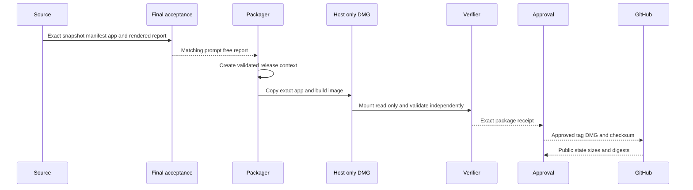

## Summary

This flow packages one exact signed wrapper host, verifies the final DMG independently, records prompt-free approval, and publishes a normal release in the same repository. Only the DMG and checksum become public assets. Installation and profile changes remain separate owner actions.

## Trigger

Start only after the release-bound source is complete, the app is signed, the one-profile rendered smoke matches it, and prompt-free final acceptance passes.

## Sequence diagram

## Steps

1. Finish the version bump and wrapper changes before running the complete source gate.
2. Build from a clean immutable commit, reusing the verified [Compiled Host Cache](../modules/compiled-host-cache.md) when compilation inputs did not change.
3. Run static smoke, the one persistent-profile rendered smoke, and exact-source final acceptance.
4. Create an annotated tag that matches the wrapper version and manifest source commit.
5. Run the [Host Release](../modules/host-release.md) packager. It performs one full validation and binds the result to one release context.
6. Check the staging copy against that context, then create the read-only DMG and five local release files.
7. Let the independent verifier mount the DMG and rebuild its own context from the mounted app.
8. Record prompt-free approval for the exact package. Approval does not install the app or write the production profile.
9. Run publication with the explicit `--publish` flag. The publisher pushes `main` and the annotated tag, uploads only the DMG and checksum, and creates neither a draft nor a prerelease.
10. Verify the public release state, asset names, server sizes, and downloaded SHA-256 digests.
11. Treat installation, Gatekeeper, Safe Storage, licence, and account prompts as separate user setup.

## Failure modes

- The source tag, release lock, snapshot, app, manifest, rendered report, or acceptance report identify different sets.
- The copied app differs from the fully validated release context.
- The mounted DMG differs from the compatibility record or includes private or proprietary data.
- Approval changes the installed app or production profile.
- Publication includes a local compatibility or verification file instead of only the DMG and checksum.
- GitHub reports a draft, prerelease, wrong asset, wrong size, or changed digest.

## Related

- [Release trust and compatibility](../architecture/release-trust-and-compatibility.md)
- [Approved Release Set](../modules/approved-release-set.md)
- [Verification Harness](../modules/verification-harness.md)
