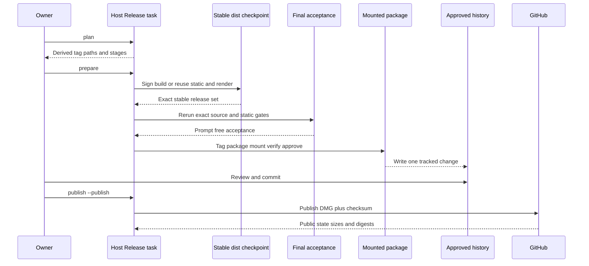

## Summary

This flow prepares one exact signed wrapper host, verifies the final DMG, records approval, and publishes a normal release in this repository. Only the DMG and checksum become public. Installation and profile changes remain separate user actions.

Preparation is one task. The owner does not run a second full gate, build, static smoke, or rendered smoke first unless diagnosing a failure.

## Trigger

Start after the version bump and every release-bound wrapper change are committed.

## Sequence diagram

## Steps

1. Finish and commit the exact release source.
2. Inspect `./script/release_host.sh plan`.
3. Run `./script/release_host.sh prepare`.
4. Let preparation check signing, build or reuse the host, run static and one-profile rendered smoke, perform final acceptance, tag, package, independently verify, approve, and record history.
5. If evidence already exists, require complete identity, file-set, and digest validation before reuse.
6. Review and commit the single `host/approved-release-history.json` change.
7. Run `./script/release_host.sh publish --publish`.
8. Let the publisher verify a normal non-draft, non-prerelease release, asset names, sizes, and downloaded digests.
9. Treat installation, Gatekeeper, Safe Storage, licence, and account prompts as separate setup.

## Failure modes

- Signing readiness fails before assembly.
- Another command owns the `dist/` lease.
- Acceptance is missing, incomplete, or belongs to another source, app, or release lock.
- The tag is lightweight, points to another commit, or is not contained in `main`.
- A package directory is missing one of its five local files or contains an extra file.
- Reused assets or approval evidence fail exact digest or identity checks.
- The tracked approval history was not reviewed and committed before publication.
- The package contains DBCode, profile data, credentials, or another forbidden private asset.
- GitHub reports a draft, prerelease, wrong asset, wrong size, or changed digest.

## Related

- [Host Release](../modules/host-release.md)
- [Patch Plan and build](../modules/patch-plan-and-build.md)
- [Release trust and compatibility](../architecture/release-trust-and-compatibility.md)
- [Approved Release Set](../modules/approved-release-set.md)
- [Verification Harness](../modules/verification-harness.md)