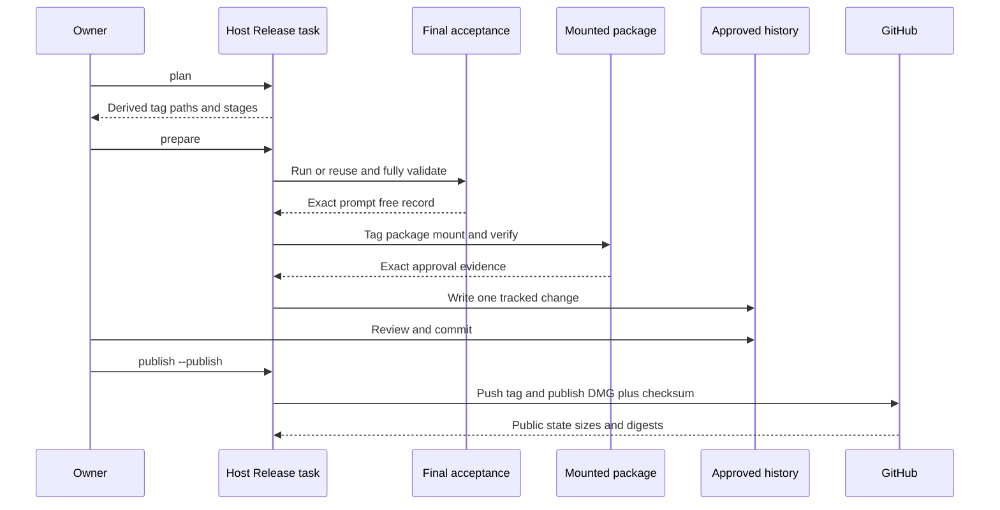

## Summary

This flow prepares one exact signed wrapper host, verifies the final DMG, records approval, and publishes a normal release in this repository. Only the DMG and checksum become public. Installation and profile changes remain separate owner actions.

## Trigger

Start after the version bump is complete, the app is signed, and the matching one-profile rendered report exists.

## Sequence diagram

## Steps

1. Finish the version bump and wrapper changes.
2. Build and sign once. Reuse the verified [Compiled Host Cache](../modules/compiled-host-cache.md) when compilation inputs did not change.
3. Run static and one-profile rendered checks required by the release boundary.
4. Inspect `./script/release_host.sh plan`.
5. Run `./script/release_host.sh prepare`. Complete acceptance is validated before the tag. The task then packages, mounts, verifies, approves, and records the exact set.
6. If exact acceptance, assets, or approval already exist, the task validates their full binding before reusing them.
7. Review and commit the single `host/approved-release-history.json` change.
8. Run `./script/release_host.sh publish --publish`.
9. Let the publisher verify a normal non-draft, non-prerelease GitHub release, asset names, sizes, and downloaded digests.
10. Treat installation, Gatekeeper, Safe Storage, licence, and account prompts as separate user setup.

## Failure modes

- Acceptance is missing, incomplete, or belongs to another source, app, or release lock.
- The tag is lightweight, points to another commit, or is not contained in `main`.
- Reused assets or approval evidence fail exact digest or identity checks.
- The tracked approval history was not reviewed and committed before publication.
- The package contains DBCode, profile data, credentials, or another forbidden private asset.
- GitHub reports a draft, prerelease, wrong asset, wrong size, or changed digest.

## Related

- [Host Release](../modules/host-release.md)
- [Release trust and compatibility](../architecture/release-trust-and-compatibility.md)
- [Approved Release Set](../modules/approved-release-set.md)
- [Verification Harness](../modules/verification-harness.md)