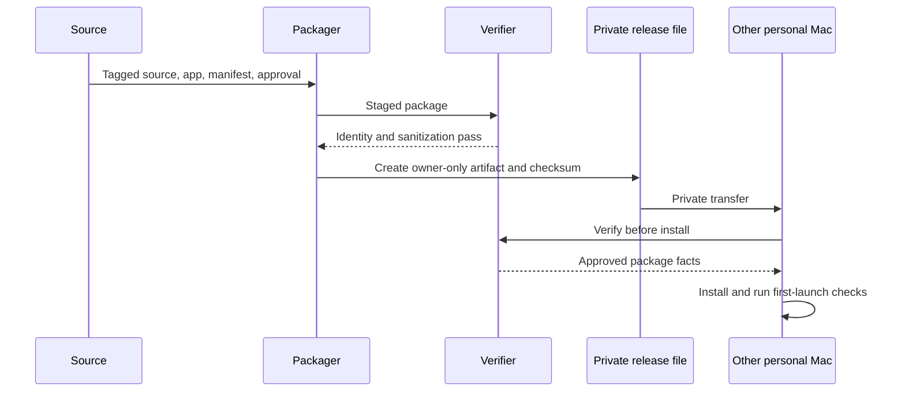

## Summary

This flow packages a locally signed and approved app for private use on another Mac owned by the same person. It deliberately separates public source from private package contents and verifies both the package metadata and the installed result.

## Trigger

Run only after the candidate release set has passed its required acceptance checks and the source commit is represented by a trusted local tag.

## Sequence diagram

## Steps

1. Confirm the source tag contains the release lock used by the build.
2. Confirm the build manifest, app identity, extension policy, profile schema, and approved set agree.
3. Verify the app and helper signatures before packaging.
4. Generate sanitized compatibility metadata. It must say that licence and profile contents are not included.
5. Build the private release artifact and a separate checksum.
6. Place it only in the owner's private transfer location. A public GitHub repository does not make the private binary suitable for general distribution.
7. On the target Mac, download the artifact and checksum through the owner's account, verify them, and inspect the mounted package.
8. Install the app, create the target machine's standalone profile, install verified packages, and perform the [first-run flow](first-run-activate-and-query.md).
9. Fully quit and relaunch to confirm app identity, secure storage, licence, credentials, and profile persistence.

## Failure modes

- The source tag, release lock, build manifest, or approval record identify different sets.
- A credential, licence, private profile path, or raw evidence file leaks into the package metadata.
- The checksum changes during upload or download.
- The target Mac treats the locally signed app as a different identity, causing new Keychain prompts.
- A private package is mistaken for a notarized public distribution. This project intentionally does not claim that distribution model.
- The app launches but the target profile or installed package set is incomplete.

## Related

- [Private Personal Release](../modules/private-personal-release.md)
- [Focused host and private profile](../architecture/focused-host-and-private-profile.md)
- [Choose a verification level](../guides/choose-a-verification-level.md)
