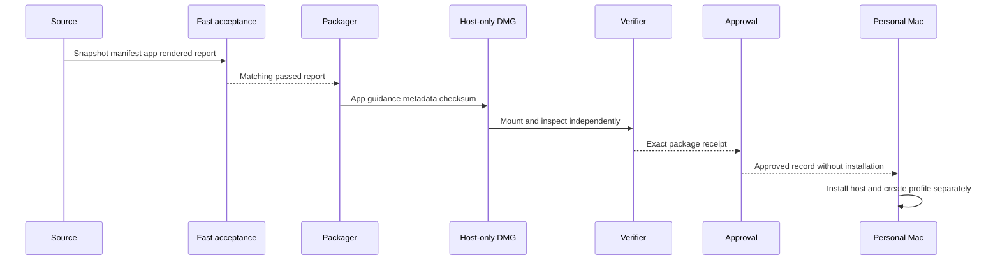

## Summary

This flow packages one locally signed, prompt-free accepted host for private use on another Mac owned by the same person. It separates public source, host-only package contents, approval evidence, installation, and private profile state. The final mounted image is verified independently before approval can be recorded.

## Trigger

Run only after final acceptance passes for the exact signed app and an annotated source tag points to the immutable commit in its manifest.

## Sequence diagram

## Steps

1. Confirm the annotated source tag resolves to the manifest's immutable source commit.
2. Confirm the tag's release lock, source snapshot, compiled-host ID, signed app, and manifest agree.
3. Require the prompt-free acceptance report for the exact release-set ID.
4. Verify the app and nested helper signatures.
5. Generate sanitized metadata that states DBCode, licence, and profile contents are not included.
6. Build the DMG, external checksum, and verification receipt under the registered private-release root.
7. Mount the final image read-only and independently recheck contents, digest, signatures, and compatibility record.
8. Run prompt-free approval with the exact release-set ID. It consumes the final mounted-package receipt and does not rerun live signature checks against a build-app path.
9. Review the generated attestation, approved record, and merged history before adding the exact record to maintained approved history. Approval does not launch or install the app and does not write the production profile.
10. Transfer only through the owner's private location.
11. On the target Mac, verify the checksum, install the host, then install the pinned external packages into a new Standalone DBCode Profile.
12. Handle Gatekeeper, Safe Storage, licence, or account prompts as normal user setup, outside automated deployment.

The current checkpoint completed steps 1–9 for private release `v0.1.1`, with DBCode `1.36.4` on the retained host. The app and production profile were not changed.

## Failure modes

- Source tag, release lock, snapshot, app, manifest, or acceptance report identify different sets.
- The acceptance report came from another app digest or rendered profile run.
- Private paths, credentials, licences, packages, or raw evidence enter the DMG.
- The checksum changes during transfer.
- The target treats the locally signed app as a new identity and asks for approval.
- Packaging or verification writes outside the registered private-release root.
- Approval receives an incomplete schema-3 report, a changed receipt, the wrong exact ID, or an attestation that claims installation.
- An existing approval output is overwritten instead of reviewed as immutable evidence.

## Related

- [Private Personal Release](../modules/private-personal-release.md)
- [Release Source Snapshot](../modules/release-source-snapshot.md)
- [Verification Harness](../modules/verification-harness.md)
- [Focused host and private profile](../architecture/focused-host-and-private-profile.md)