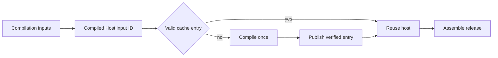

## Summary

Compiled Host Cache separates expensive Code OSS compilation from smaller release assembly. It gives the exact compilation inputs a content-addressed ID, verifies cached app bytes, file modes, and symbolic links, and records the compiler environment in a receipt.

The cache key now distinguishes profile-only identity from values compiled into the host. User-data, extension, backup-folder, and profile-schema changes can reuse the host. The storage namespace and query folder invalidate it because the focused shell reads those values from the compiled product record.

## Responsibilities

- Hash upstream revisions, toolchain pins, compile-time product values, active patches, icon, slimming policy, compilation code, and Git's regular-or-executable file state.
- Exclude DBCode packages, profile-only names, profile schema, documentation, tests, and assembly-only files from the compilation ID.
- Include query-storage names and other values embedded in the Code OSS or VSCodium output.
- Publish a compiled app and environment receipt atomically.
- Verify the cached app digest, file modes, links, identity, and receipt before reuse.
- Preserve an invalid existing entry for investigation, then rebuild it.
- Report `hit` or `miss-built` in the final manifest.

## Flow

## Public API / entry points

[`compile_host.sh`](https://github.com/alexwck/dbcode-wrapper/blob/ddaa6a0b7b906af9994221e98ca8f0a0ef3c93b1/script/compile_host.sh) prepares and compiles the upstream host. [`assemble_host.sh`](https://github.com/alexwck/dbcode-wrapper/blob/ddaa6a0b7b906af9994221e98ca8f0a0ef3c93b1/script/assemble_host.sh) resolves or creates the cache entry, then copies it into the release bundle before assembly and signing.

## Key files

- [`script/lib/compiled_host_cache.sh`](https://github.com/alexwck/dbcode-wrapper/blob/ddaa6a0b7b906af9994221e98ca8f0a0ef3c93b1/script/lib/compiled_host_cache.sh) — input ID, normalized source modes, receipt, integrity, resolution, and publication.
- [`script/lib/release_specification.sh`](https://github.com/alexwck/dbcode-wrapper/blob/ddaa6a0b7b906af9994221e98ca8f0a0ef3c93b1/script/lib/release_specification.sh) — the compile-time product projection.
- [`script/test_compiled_host_cache_contract.sh`](https://github.com/alexwck/dbcode-wrapper/blob/ddaa6a0b7b906af9994221e98ca8f0a0ef3c93b1/script/test_compiled_host_cache_contract.sh) — reuse, invalidation, permission, tamper, and path checks.
- [`script/lib/artifact_digest.sh`](https://github.com/alexwck/dbcode-wrapper/blob/ddaa6a0b7b906af9994221e98ca8f0a0ef3c93b1/script/lib/artifact_digest.sh) — deterministic app digest including modes and links.

## Dependencies

The cache consumes a verified [Release Source Snapshot](release-source-snapshot.md), [Release Specification](release-specification.md), patch plan, slimming policy, and pinned toolchain. Its ignored entries are protected reusable output under [Generated Workspace Retention](generated-workspace-retention.md).

## Participates in

- [Build, sign, and launch](../flows/build-sign-and-launch.md)
- [Review an upstream update](../guides/review-an-upstream-update.md)

## Related

- [Patch Plan and build](patch-plan-and-build.md)
- [Profile Layout and Setup](profile-layout-and-setup.md)
- [Verification Harness](verification-harness.md)
- [Release trust and compatibility](../architecture/release-trust-and-compatibility.md)