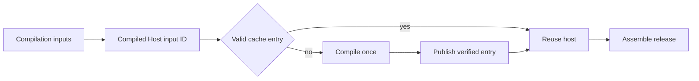

## Summary

Compiled Host Cache separates expensive Code OSS compilation from smaller release assembly. It gives the exact compilation inputs a content-addressed ID, verifies cached app bytes, file modes, and symbolic links, and records the compiler environment in a receipt.

The key distinguishes profile-only identity from values compiled into the host. User-data, extension, backup-folder, profile-schema, and dated slimming-evidence changes can reuse the host. Query storage invalidates it because the focused shell reads that value from the compiled product record. Changes to the active Release Specification projection or the Patch Plan's build-relevant projection invalidate the cache. Descriptive Patch Plan wording does not.

## Responsibilities

- Hash upstream revisions, toolchain pins, compile-time product values, the Patch Plan's build-relevant projection, the first-class Code OSS overlay, small patches, icon, active slimming policy, compilation code, and Git's regular-or-executable file state.
- Exclude DBCode packages, profile-only names, profile schema, descriptive Patch Plan wording, documentation, tests, dated measurements, and assembly-only files from the compilation ID.
- Include query-storage names and other values embedded in the Code OSS or VSCodium output.
- Publish a compiled app and environment receipt atomically.
- Verify the cached app digest, file modes, links, identity, and receipt before reuse.
- Preserve an invalid existing entry for investigation, then rebuild it.
- Report `hit` or `miss-built` in the final manifest.

## Flow

## Public API / entry points

[compile_host.sh](https://github.com/alexwck/dbcode-wrapper/blob/5f77cbeeb00b79432ca86b95b0d392d68f0d1d27/script/compile_host.sh) prepares and compiles the upstream host. [assemble_host.sh](https://github.com/alexwck/dbcode-wrapper/blob/5f77cbeeb00b79432ca86b95b0d392d68f0d1d27/script/assemble_host.sh) resolves or creates the cache entry, then copies it into the release bundle before assembly and signing.

## Key files

- [compiled_host_cache.sh](https://github.com/alexwck/dbcode-wrapper/blob/02a3c237d5e7baf9c741e1a1dcd7828730490032/script/lib/compiled_host_cache.sh) — input ID, normalized source modes, active projection digest, receipt, integrity, resolution, and publication.
- [patch_plan.sh](https://github.com/alexwck/dbcode-wrapper/blob/02a3c237d5e7baf9c741e1a1dcd7828730490032/script/lib/patch_plan.sh) — canonical build-relevant Patch Plan projection.
- [patch-plan.json](https://github.com/alexwck/dbcode-wrapper/blob/02a3c237d5e7baf9c741e1a1dcd7828730490032/host/patches/patch-plan.json) — patch and first-class overlay identity.
- [release_specification_records.jq](https://github.com/alexwck/dbcode-wrapper/blob/02a3c237d5e7baf9c741e1a1dcd7828730490032/script/lib/release_specification_records.jq) — the active compile-time product projection.
- [test_compiled_host_cache_contract.sh](https://github.com/alexwck/dbcode-wrapper/blob/02a3c237d5e7baf9c741e1a1dcd7828730490032/script/test_compiled_host_cache_contract.sh) — reuse, invalidation, permission, tamper, and path checks.

## Dependencies

The cache consumes a verified [Release Source Snapshot](release-source-snapshot.md), [Release Specification](release-specification.md), [Patch Plan and build](patch-plan-and-build.md), active slimming policy, and the pinned toolchain. Its ignored entries are protected reusable output under [Generated Workspace Retention](generated-workspace-retention.md).

## Participates in

- [Build, sign, and launch](../flows/build-sign-and-launch.md)
- [Review an upstream update](../guides/review-an-upstream-update.md)

## Related

- [Profile Layout and Setup](profile-layout-and-setup.md)
- [Verification Harness](verification-harness.md)
- [Release trust and compatibility](../architecture/release-trust-and-compatibility.md)