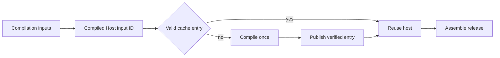

## Summary

Compiled Host Cache separates expensive Code OSS compilation from the smaller release assembly step. It gives the exact compilation inputs a content-addressed ID, verifies the cached app byte-for-byte including file modes and symbolic links, and records the compiler environment in a receipt.

A DBCode-only, documentation, test, or assembly-only change can reuse the host when the compilation ID is unchanged. The release still gets a fresh source snapshot, wrapper records, signature, manifest, and acceptance report.

## Responsibilities

- Hash upstream revisions, toolchain pins, compile-time product values, active patches, icon, slimming policy, and compilation code.
- Exclude DBCode payload and assembly-only inputs from the compilation ID.
- Publish a compiled app and environment receipt atomically.
- Verify the cached app digest, file modes, links, identity, and receipt before reuse.
- Quarantine an invalid existing entry instead of silently trusting or overwriting it.
- Report `hit` or `miss-built` in the final manifest.

## Flow

## Public API / entry points

[`compile_host.sh`](https://github.com/alexwck/dbcode-wrapper/blob/2008ff48373c1aac378d0d1ec903e96a88ec1e29/script/compile_host.sh) prepares and compiles the upstream host. [`assemble_host.sh`](https://github.com/alexwck/dbcode-wrapper/blob/2008ff48373c1aac378d0d1ec903e96a88ec1e29/script/assemble_host.sh) resolves or creates the cache entry, then copies it into the release bundle before assembly and signing.

## Key files

- [`script/lib/compiled_host_cache.sh`](https://github.com/alexwck/dbcode-wrapper/blob/2008ff48373c1aac378d0d1ec903e96a88ec1e29/script/lib/compiled_host_cache.sh) — input ID, receipt, integrity, resolution, and publication logic.
- [`script/test_compiled_host_cache_contract.sh`](https://github.com/alexwck/dbcode-wrapper/blob/2008ff48373c1aac378d0d1ec903e96a88ec1e29/script/test_compiled_host_cache_contract.sh) — cache-hit, invalidation, tamper, and path checks.
- [`script/lib/artifact_digest.sh`](https://github.com/alexwck/dbcode-wrapper/blob/2008ff48373c1aac378d0d1ec903e96a88ec1e29/script/lib/artifact_digest.sh) — deterministic app digest including modes and links.

## Dependencies

The cache consumes a verified [Release Source Snapshot](release-source-snapshot.md), [Release Specification](release-specification.md), patch plan, slimming policy, and pinned toolchain. Its ignored entries are protected reusable output under [Generated Workspace Retention](generated-workspace-retention.md).

## Participates in

- [Build, sign, and launch](../flows/build-sign-and-launch.md)
- [Review an upstream update](../guides/review-an-upstream-update.md)

## Related

- [Patch Plan and build](patch-plan-and-build.md)
- [Verification Harness](verification-harness.md)
- [Release trust and compatibility](../architecture/release-trust-and-compatibility.md)