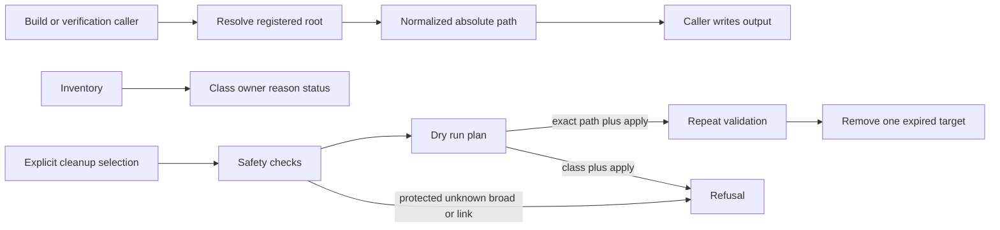

## Summary

Generated Workspace Retention is the ownership and safety boundary for ignored output from builds, tests, rollback, caches, current Host Releases, and retained evidence. It is not a general disk cleaner. Protected and unknown paths are reported without traversal, and cleanup is a dry run unless one exact validated expired path is selected with `--apply`.

The current inventory has no deletion-eligible path. Reusable caches, worktrees, the persistent QA profile, accepted apps, current Host Release assets, retained evidence, and rollback material remain protected.

## Responsibilities

- Register rebuildable work, reusable caches, active and retained evidence, rollback evidence, current Host Release assets, expired output, and unknown output.
- Protect content-addressed Compiled Host entries and their rejected-entry quarantine.
- Normalize relative paths, absolute paths, and paths containing spaces before callers use them.
- Refuse broad roots, home roots, symbolic links, paths outside the safety root, and unregistered targets.
- Avoid reading or measuring private profile contents and protected release artifacts.
- Measure only paths explicitly registered as expired.
- Require one explicit class or exact path for a cleanup plan; a class cannot be applied.
- Revalidate one exact expired path immediately before removal and verify that it is gone.

## Classification and decision flow

## Public API / entry points

[generated_workspace.sh](https://github.com/alexwck/dbcode-wrapper/blob/e02160a3b5363fc4e91c5282f7818ed908624c6d/script/generated_workspace.sh) provides inventory, dry-run planning, and exact-path apply. [generated_workspace.sh](https://github.com/alexwck/dbcode-wrapper/blob/e02160a3b5363fc4e91c5282f7818ed908624c6d/script/lib/generated_workspace.sh) is the shell adapter. [generated-workspace-retention.js](https://github.com/alexwck/dbcode-wrapper/blob/e02160a3b5363fc4e91c5282f7818ed908624c6d/script/lib/generated-workspace-retention.js) owns the registry and safety decisions.

## Design decisions

- Retention follows declared ownership, not age or a guessed folder name.
- Reusable compiled hosts stay protected because deleting them can turn a quick release into a full build.
- Current Host Release output has its own protected root.
- Retained evidence stays protected until its owning workflow records expiry.
- Protected artifacts use an uninspected size status.
- Cleanup mutation is limited to one exact validated expired path.

## Participates in

- [Build, sign, and launch](../flows/build-sign-and-launch.md)
- [Approval and guarded rollback](../flows/approval-and-guarded-rollback.md)
- [Package and publish a Host Release](../flows/package-and-publish-host-release.md)
- [Choose a verification level](../guides/choose-a-verification-level.md)

## Related

- [Compiled Host Cache](compiled-host-cache.md)
- [Patch Plan and build](patch-plan-and-build.md)
- [Verification Harness](verification-harness.md)
- [Focused host and private profile](../architecture/focused-host-and-private-profile.md)
