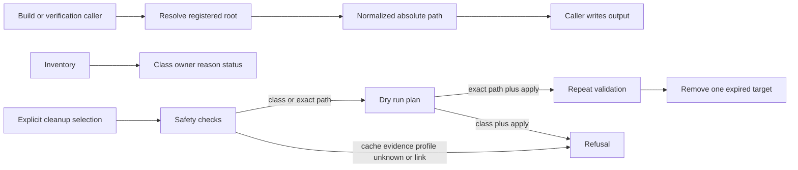

## Summary

Generated Workspace Retention is the ownership and safety boundary for ignored output from builds, tests, upgrades, rollback, caches, and private packaging. Each maintained root has a class, owner, reason, and cleanup decision. It is not a general disk cleaner: protected and unknown paths are reported without traversal, and cleanup plans remain read-only by default. An explicit apply can remove one exact expired target after repeated validation; class-wide mutation remains disabled.

The current inventory has no unknown root and no remaining expired item. Exact cleanup removed Finder metadata, the retired short-path connection-catalogue profile, and an abandoned smoke-backup root. The current QA profile, rendered screenshots, reusable caches, worktrees, accepted release assets, rollback evidence, and historical controlled-upgrade receipts remain protected.

## Responsibilities

- Register rebuildable work, reusable caches, active evidence, rollback evidence, final transfer assets, deliberately expired output, and unknown output.
- Protect content-addressed compiled-host entries and their rejected-entry quarantine.
- Normalize relative paths, absolute paths, and paths containing spaces before callers use them.
- Refuse broad roots, home roots, symbolic links, paths outside the safety root, and unregistered cleanup targets.
- Avoid reading or measuring private profile contents and other protected artifacts.
- Measure only paths that the contract explicitly registers as expired, including descendants under the dedicated expired root.
- Require one explicit class or exact path for cleanup planning; a class cannot be applied.
- Revalidate one exact expired path immediately before removal and verify that it no longer exists.

## Classification and decision flow

## Public API / entry points

[`generated_workspace.sh`](https://github.com/alexwck/dbcode-wrapper/blob/b9186c13138e4da51d4390da4ed04af59b55586f/script/generated_workspace.sh) provides `inventory`, dry-run cleanup planning, and exact-path cleanup with `--apply`. Shell workflows use [`script/lib/generated_workspace.sh`](https://github.com/alexwck/dbcode-wrapper/blob/b9186c13138e4da51d4390da4ed04af59b55586f/script/lib/generated_workspace.sh) to resolve the same roots.

## Key files

- [`script/lib/generated-workspace-retention.js`](https://github.com/alexwck/dbcode-wrapper/blob/b9186c13138e4da51d4390da4ed04af59b55586f/script/lib/generated-workspace-retention.js) — registry, validation, inventory, cleanup planning, and exact-path execution.
- [`script/generated_workspace.cjs`](https://github.com/alexwck/dbcode-wrapper/blob/b9186c13138e4da51d4390da4ed04af59b55586f/script/generated_workspace.cjs) — task command adapter and explicit `--apply` boundary.
- [`script/lib/compiled_host_cache.sh`](https://github.com/alexwck/dbcode-wrapper/blob/b9186c13138e4da51d4390da4ed04af59b55586f/script/lib/compiled_host_cache.sh) — protected reusable cache consumer.
- [`script/test_generated_workspace_contract.sh`](https://github.com/alexwck/dbcode-wrapper/blob/b9186c13138e4da51d4390da4ed04af59b55586f/script/test_generated_workspace_contract.sh) — public path, classification, planning, execution, and refusal checks.

## Design decisions

- Retention follows declared ownership, not age or a guessed directory name.
- Reusable compiled hosts stay protected because deleting them can turn a quick release into a full build.
- Accepted apps, active evidence, rollback backups, and final transfer assets remain protected until their workflows release them.
- Retiring an executable harness does not expire its accepted historical evidence.
- Protected artifacts use an uninspected size status.
- Callers use the normalized absolute path returned by the contract.
- Cleanup mutation is limited to one exact validated expired path; class-wide mutation is intentionally absent.

## Participates in

- [Build, sign, and launch](../flows/build-sign-and-launch.md)
- [Approval and guarded rollback](../flows/approval-and-guarded-rollback.md)
- [Package and transfer a private release](../flows/package-and-transfer-private-release.md)
- [Choose a verification level](../guides/choose-a-verification-level.md)

## Related

- [Compiled Host Cache](compiled-host-cache.md)
- [Patch Plan and build](patch-plan-and-build.md)
- [Verification Harness](verification-harness.md)
- [Focused host and private profile](../architecture/focused-host-and-private-profile.md)