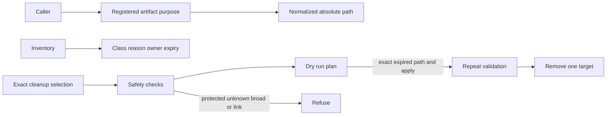

## Summary

Generated Workspace Retention is the safety boundary for ignored build, coordination, cache, release, rollback, and evidence output. It is not a general disk cleaner.

Each registered root is classified by artifact purpose and explicit expiry. Protected and unknown paths are reported without traversing them. The `build-coordination` root owns `.build/locks`, and `assembly-work` owns `.build/assembly`; both are rebuildable work and are not automatic cleanup candidates.

## Responsibilities

- Register rebuildable work, reusable caches, active evidence, retained evidence, rollback evidence, release assets, explicitly expired output, and unknown output.
- Resolve standard paths for build, rendered, acceptance, package, and release-task callers.
- Normalize relative, absolute, and space-containing paths before callers use them.
- Refuse broad roots, home roots, symbolic links, paths outside the safety root, and unregistered targets.
- Avoid reading or measuring private profiles and protected artifacts.
- Measure only output explicitly registered as expired.
- Keep cleanup as a dry run unless one exact validated expired path is supplied with `--apply`.
- Refuse class-wide apply and revalidate an exact target immediately before removal.

## Classification and decision flow

## Public API / entry points

[generated_workspace.sh](https://github.com/alexwck/dbcode-wrapper/blob/2191402c377a4caa9c941af83c6cbcf6c0d41809/script/generated_workspace.sh) provides inventory, path resolution, dry-run planning, and exact-path apply. [generated_workspace.cjs](https://github.com/alexwck/dbcode-wrapper/blob/2191402c377a4caa9c941af83c6cbcf6c0d41809/script/generated_workspace.cjs) is the task interface. [generated-workspace-retention.js](https://github.com/alexwck/dbcode-wrapper/blob/2191402c377a4caa9c941af83c6cbcf6c0d41809/script/lib/generated-workspace-retention.js) owns the registry and safety decisions.

## Design decisions

- Purpose and explicit expiry determine retention.
- Build locks and staged assembly have named rebuildable-work roots.
- Reusable compiled hosts stay protected because deleting them can turn a quick release into a full build.
- Current release output and rollback evidence have protected roots.
- Protected artifacts use an uninspected size status.
- Cleanup mutation is limited to one exact validated expired path.

## Participates in

- [Build, sign, and launch](../flows/build-sign-and-launch.md)
- [Approval and guarded rollback](../flows/approval-and-guarded-rollback.md)
- [Package and publish a Host Release](../flows/package-and-publish-host-release.md)
- [Choose a verification level](../guides/choose-a-verification-level.md)

## Related

- [Compiled Host Cache](compiled-host-cache.md)
- [Patch Plan and build](patch-plan-and-build.md)
- [Verification Harness](verification-harness.md)
- [Focused host and private profile](../architecture/focused-host-and-private-profile.md)