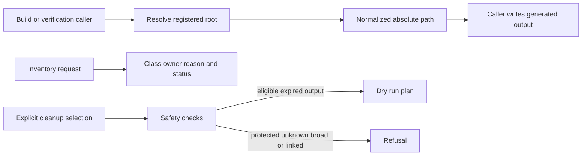

## Summary

Generated Workspace Retention is the ownership and safety boundary for ignored output produced by builds, tests, upgrades, rollback, and private packaging. It gives every maintained root a class, owner, reason, and cleanup decision. It is deliberately not a general disk cleaner: protected and unknown paths are reported without being traversed, and the first implementation can only produce a dry-run plan.

## Responsibilities

- Register rebuildable work, reusable caches, active evidence, rollback evidence, final transfer assets, deliberately expired output, and unknown output.
- Normalize documented relative paths, absolute paths, and paths containing spaces before a caller writes to them.
- Refuse repository roots, home roots, symbolic links, paths outside their safety root, and unregistered cleanup targets.
- Avoid reading or measuring private profile contents and other protected artifacts.
- Measure only output already declared expired under the dedicated expired root.
- Require one explicit class or exact path for cleanup planning.
- Return a dry-run plan without deleting anything.
- Keep production evidence under registered repository roots; temporary paths are available only to maintained test fixtures through an explicit test gate.

## Classification and decision flow

## Public API / entry points

[`generated_workspace.sh`](https://github.com/alexwck/dbcode-wrapper/blob/fbf29827376fd0ea5867082b78e38862878f42b6/script/generated_workspace.sh) is the task-level command. `inventory` reports the contract; `cleanup --class expired-output` and `cleanup --path PATH` validate one explicit selection and return a dry-run plan.

[`generated_workspace.cjs`](https://github.com/alexwck/dbcode-wrapper/blob/fbf29827376fd0ea5867082b78e38862878f42b6/script/generated_workspace.cjs) is its Node command adapter. Shell workflows use [`generated_workspace.sh`](https://github.com/alexwck/dbcode-wrapper/blob/fbf29827376fd0ea5867082b78e38862878f42b6/script/lib/generated_workspace.sh) to resolve or assert roots through the same module.

## Key files

- [`script/lib/generated-workspace-retention.js`](https://github.com/alexwck/dbcode-wrapper/blob/fbf29827376fd0ea5867082b78e38862878f42b6/script/lib/generated-workspace-retention.js) — root registry, path validation, inventory, and cleanup planning.
- [`script/generated_workspace.cjs`](https://github.com/alexwck/dbcode-wrapper/blob/fbf29827376fd0ea5867082b78e38862878f42b6/script/generated_workspace.cjs) — public command parser and JSON output.
- [`script/lib/generated_workspace.sh`](https://github.com/alexwck/dbcode-wrapper/blob/fbf29827376fd0ea5867082b78e38862878f42b6/script/lib/generated_workspace.sh) — shared shell adapter used by production workflows.
- [`script/test_generated_workspace_retention.mjs`](https://github.com/alexwck/dbcode-wrapper/blob/fbf29827376fd0ea5867082b78e38862878f42b6/script/test_generated_workspace_retention.mjs) and [`script/test_generated_workspace_contract.sh`](https://github.com/alexwck/dbcode-wrapper/blob/fbf29827376fd0ea5867082b78e38862878f42b6/script/test_generated_workspace_contract.sh) — focused behavior and public-interface checks.

## Design decisions

- Retention follows declared ownership, not file age or a guessed directory name.
- Caches and worktrees remain protected until their owning workflow explicitly expires them.
- Accepted apps, active acceptance records, rollback backups, and final transfer assets remain protected even after a broader milestone closes; their own workflow must release them.
- Protected artifacts use an uninspected size status so inventory does not expose or traverse private state.
- Callers use the normalized path returned by the contract. A relative path cannot be validated in one working directory and then used in another.
- Bootstrap has a small shell guard for the period before pinned Node is available. All later decisions come from the shared module.
- Cleanup mutation is intentionally absent. Adding deletion would require a separate reviewed contract and new evidence.

## Participates in

- [Build, sign, and launch](../flows/build-sign-and-launch.md)
- [Controlled upgrade and rollback](../flows/controlled-upgrade-and-rollback.md)
- [Package and transfer a private release](../flows/package-and-transfer-private-release.md)
- [Choose a verification level](../guides/choose-a-verification-level.md)

## Related

- [Patch Plan and build](patch-plan-and-build.md)
- [Verification Harness](verification-harness.md)
- [Focused host and private profile](../architecture/focused-host-and-private-profile.md)
- [Release trust and compatibility](../architecture/release-trust-and-compatibility.md)
